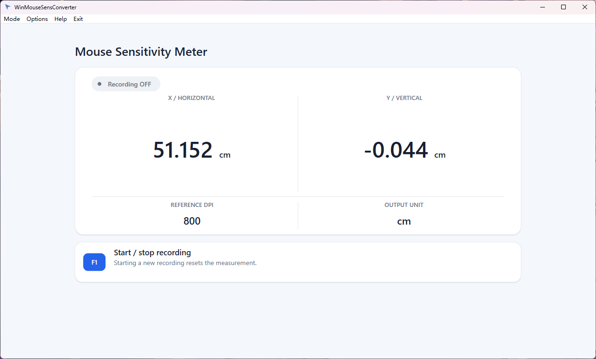
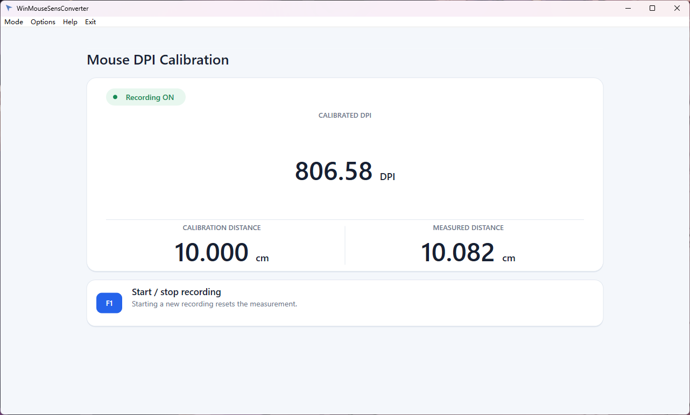
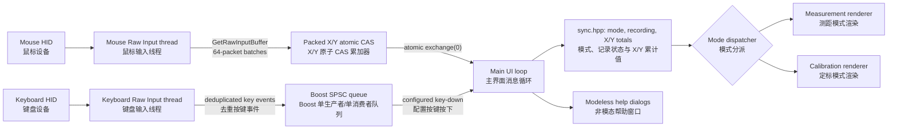

# WinMouseSensConverter

> A native Windows mouse-distance meter and DPI calibration tool based on Raw Input.  
> 基于 Windows Raw Input 的原生鼠标测距与 DPI 定标工具。

<p align="center">
  <a href="#english">English</a> · <a href="#chinese">简体中文</a>
</p>





---

<a id="english"></a>

## English

### What is WinMouseSensConverter?

WinMouseSensConverter measures how far your mouse moves while you rotate the in-game camera through a known horizontal angle. By repeating the same measurement in another game, you can tune that game's sensitivity until both games require the same mouse travel for the same camera rotation.

It also provides a dedicated DPI calibration mode. Move the mouse once along a ruler by a known physical distance, and the application derives the effective DPI from the two-dimensional Raw Input displacement. Use **Mode → Measurement** for game-distance work and **Mode → Calibration** for ruler-based DPI calibration.

The most common measurement is a full 360-degree turn, usually described as **counts/360°** or **cm/360°**. The application records and displays the mouse's raw X/Y counts in the background, so you can start and stop a measurement with the configured recording key (`F1` by default) while the game remains focused. The horizontal X result is used for sensitivity matching, while Y makes unintended vertical drift visible.

This is an **empirical measurement and calibration tool**, not a database-driven converter. It does not know each game's internal sensitivity formula and does not change game settings automatically. That makes it useful even when two games use different engines, scales, rounding rules, or undocumented sensitivity behavior.

### Highlights

- Native Windows desktop application written in C++20.
- Buffered Raw Input capture on dedicated keyboard and mouse message threads.
- Configurable background recording control (`F1` by default) without switching away from the game.
- Different notification sounds when recording starts and stops.
- Starting a new recording clears the previous measurement; stopping keeps the final value visible.
- Simultaneous X/Y measurement: right is positive X, left is negative X, down is positive Y, and up is negative Y.
- Separate Measurement and Calibration interfaces that share one recording session and can be switched without stopping or clearing it.
- DPI calibration from a known `10`–`1000 cm` ruler distance using the net two-dimensional X/Y displacement.
- Output in raw counts, inches, millimeters, centimeters, decimeters, or meters.
- Reference DPI presets: `100`, `400`, `800`, `1200`, `1600`, `3200`, and `10000`, plus a modeless `Custom...` entry for values from `1` to `999999`.
- The selected mode, Reference DPI, output unit, calibration distance, and recording key are restored from a per-user configuration file.
- Responsive, Per-Monitor-DPI-aware Direct2D/DirectWrite interface.
- Modeless About and Instruction windows that do not block input collection.
- No game injection, process-memory access, network access, telemetry, or saved measurement history; only user configuration is written.

> [!IMPORTANT]
> The executable manifest requests administrator privileges. Accept the Windows UAC prompt at startup. Compatibility still depends on the game, its input mode, and any anti-cheat or exclusive-input restrictions.

### Measurement mode quick start

1. Set the mouse to the DPI/CPI you want to use in both games. Avoid changing the hardware DPI during the comparison.
2. Start WinMouseSensConverter and accept the administrator permission prompt.
3. Open **Options → ReferenceDPI** and select the mouse's actual DPI. Choose **Custom...** to enter an integer from `1` to `999999`; invalid input is ignored and the last valid DPI remains active. For in-game measurement, choose a physical-distance unit suited to the test—usually `cm` for 360° measurements or `mm` for shorter distances. Use `raw` mainly when you need to inspect the underlying counts.
4. In the baseline game, choose a repeatable camera state and a clear reference point. A wall corner, vertical seam, or other thin landmark works better than a broad object.
5. Aim at the reference point, place the mouse at a marked starting position, and press the recording key shown in the application window (`F1` by default). The start sound confirms that recording is active and the old measurement has been cleared.
6. Rotate horizontally through a known angle—normally exactly 360°—until the crosshair returns to the same reference point.
7. Press the configured recording key again. The stop sound confirms that recording has ended; the measurement remains visible.
8. Repeat the trial several times in the same direction. Use the median of the consistent results as the baseline.
9. In the target game, reproduce the same camera state and angle. Adjust its sensitivity until the selected physical-distance measurement matches the baseline within a practical tolerance.

Move or lift the mouse back to its starting position **while recording is off**. Any mouse movement during recording is part of the measurement.

### DPI calibration workflow

1. Place a ruler beside the mouse and choose a long, straight section of the pad. Longer distances reduce the relative effect of alignment, timing, and count quantization; `20 cm` or `50 cm` is preferable when space allows.
2. Choose **Mode → Calibration**.
3. Choose **Options → Calibration Distance → 10 cm / 20 cm / 50 cm**, or select **Custom...** and enter an integer from `10` through `1000`. Custom input is always in centimeters.
4. Keep the mouse stationary, press the displayed recording key, and wait for the start sound.
5. Move the mouse once in a straight line by exactly the selected ruler distance. Do not lift, rotate, overshoot, reverse, or correct the mouse during the movement.
6. Stop at the ruler mark, keep the mouse stationary, and press the recording key again. The final calibrated DPI remains visible.
7. Repeat at least five times and compare the median of the consistent results. A large spread indicates that the physical procedure should be improved before the result is used.

Calibration uses the final net Raw Input vector:

```text
counts = sqrt(dx² + dy²)
known distance in inches = calibration_distance_cm / 2.54
calibrated DPI = counts / known distance in inches
```

This is the magnitude of the final accumulated X/Y displacement, not the sum of every packet's path length. Opposite movement on an axis cancels before the magnitude is calculated, so a curved path, reversal, or endpoint correction does not represent the ruler distance reliably.

The **Measured Distance** field converts `counts` through the selected ReferenceDPI for comparison; ReferenceDPI and Unit do not enter the calibrated-DPI formula. When Unit is `raw`, Measured Distance is the captured vector magnitude and Calibration Distance is the number of counts that the current ReferenceDPI would predict for the ruler distance. The calculated result is display-only: it never overwrites ReferenceDPI. If you want to use it for later physical-distance conversion, manually choose the nearest suitable integer through **Options → ReferenceDPI → Custom...**.

### Configuration

The selected mode, Reference DPI, output unit, calibration distance, and recording key are loaded at startup from:

```text
%LOCALAPPDATA%\WinMouseSensConverter\config.ini
```

Choose **Options → Edit Configuration File...** to open the containing directory in File Explorer. The file is not opened automatically.

Exit WinMouseSensConverter before editing `config.ini` manually. When the application exits normally, it saves its current settings and overwrites the file, so edits made while the application is running will be lost.

The file is UTF-8 text with the following format:

```ini
reference_dpi = 800
unit = cm
calibration_distance_cm = 10
mode = measurement
recording_key = 0x70
```

Valid units are `raw`, `inch`, `mm`, `cm`, `dm`, and `m`; valid modes are `measurement` and `calibration`; `calibration_distance_cm` must be an integer from `10` through `1000`. Blank lines and spaces or tabs around lines, keys, `=`, and values are allowed; both CRLF and LF line endings are accepted. Key names and enum values are case-sensitive. Unknown extra fields are ignored.

Selecting Calibration Distance → Custom keeps `Custom...` checked for the rest of that run even if the entered value is `10`, `20`, or `50`. Only the numeric value is saved. On the next start, those three values map back to their matching preset; all other valid values map to `Custom...`.

`recording_key` is a Windows Virtual-Key value from `1` through `254`. Decimal values such as `112` and hexadecimal values such as `0x70` or `0X70` are accepted; the application saves the value as two-digit uppercase hexadecimal. The main window displays the system name for the configured key, or `VK 0xNN` when Windows cannot provide one. Only values actually emitted by keyboard Raw Input can trigger recording, and configuration changes take effect on the next application start.

Every listed field is required. If the file is missing, unreadable, incomplete, duplicated, or contains an invalid value, the application uses the complete defaults (`800`, `cm`, `10 cm`, Measurement mode, and `F1`) and attempts to replace the file. Older configurations without `calibration_distance_cm` or `mode` are therefore reset in full. Changes are saved when the application exits normally. Configuration failures never prevent startup and measurement/calibration results are never saved.

### A reliable cross-game workflow

#### 1. Control the variables

Keep the following conditions stable throughout the comparison:

- The same physical mouse and hardware DPI/CPI.
- The same Windows and mouse-driver configuration.
- The same in-game input mode: raw input, mouse acceleration, smoothing, and filtering.
- The same camera context within each game: hip-fire, ADS, scoped view, vehicle view, or another specific mode.
- A fixed zoom/FOV state for the behavior you want to match.
- The same rotation angle and direction for every trial.

FOV does not itself define angular sensitivity, but different FOV, ADS, and zoom states can use separate sensitivity multipliers and can feel different visually. Measure every mode you care about separately.

#### 2. Prefer a long measurement

A 360° turn is easy to understand, but two or more full turns can reduce the relative influence of endpoint alignment and single-count quantization. For example, measure 720° and divide the displayed distance by two to obtain the distance per 360°.

Use a stable posture and enough mouse-pad space. If you must lift the mouse during a trial, the lift and landing can change the mouse angle or introduce sensor counts. A single uninterrupted sweep is preferable when practical.

#### 3. Repeat and summarize

Perform at least five trials when accuracy matters. Discard a trial only when you can identify a mistake, such as overshooting the landmark or touching the edge of the pad. The **median** is a useful baseline because it is less affected by one bad run than the mean.

Also inspect the spread. If nominally identical trials vary substantially, improve the test setup before tuning the target game. A very precise average of an unstable procedure is not a reliable reference.

#### 4. Estimate the next sensitivity value

For many games, camera rotation is approximately proportional to the in-game sensitivity value. Let:

- `B` = the absolute baseline measurement for the chosen angle;
- `T` = the absolute measurement currently obtained in the target game;
- `S` = current target-game sensitivity.

`B` and `T` must use the same output unit. A physical unit such as centimeters is normally more convenient than raw counts here.

An approximate next value is:

```text
new sensitivity ≈ S × T / B
```

If the target game requires more counts than the baseline, its sensitivity is too low and the formula increases it. Because games may round settings or use nonlinear scales, treat this as an estimate and always measure again.

### Reading the result

The interface displays the signed sum of Raw Input counts for both axes:

```text
X raw counts = Σ RAWMOUSE::lLastX
Y raw counts = Σ RAWMOUSE::lLastY
```

- Positive X is net movement to the right; negative X is net movement to the left.
- Positive Y is net movement downward; negative Y is net movement upward, following the Raw Input coordinate convention.
- Zero on an axis means no net movement on that axis. Opposite movements can cancel out.
- The selected Reference DPI and output unit are applied identically to X and Y.

For cross-game sensitivity matching, compare the horizontal X result and use the same direction in every trial or compare absolute magnitudes. The Y result helps reveal vertical drift during the sweep. A suitable physical unit is normally the better practical choice: small count-to-count variations are presented on a more meaningful scale, and gameplay sensitivity usually does not need to be matched to one individual raw count. Use `cm` for typical 360° tests, `mm` when the measured distance is short, and `raw` when diagnosing the input data itself.

Physical distance is calculated from the selected Reference DPI:

```text
inches      = raw counts / Reference DPI
millimeters = inches × 25.4
centimeters = inches × 2.54
decimeters  = inches × 0.254
meters      = inches × 0.0254
```

Reference DPI is only a conversion factor; changing it does not change the captured raw counts or the underlying measurement precision. Converting to a physical unit does not remove sensor or operating error—it makes the size of that variation easier to interpret and lets you use a realistic matching tolerance. A mouse's real CPI can differ from its advertised setting, so absolute distance is only as accurate as the DPI value you provide; for cross-game matching, keep the same mouse/DPI and the same Reference DPI in both tests.

### How it works

#### Raw mouse movement

Windows defines `RAWMOUSE::lLastX` and `lLastY` as signed X/Y movement. For relative mouse reports, they describe movement relative to the previous report. Unlike legacy `WM_MOUSEMOVE` cursor messages, Raw Input mouse events are not affected by the pointer speed and acceleration configured in the Windows Control Panel. See Microsoft's [RAWMOUSE documentation](https://learn.microsoft.com/en-us/windows/win32/api/winuser/ns-winuser-rawmouse) and [Raw Input overview](https://learn.microsoft.com/en-us/windows/win32/inputdev/about-raw-input).

The mouse input thread registers a message-only window for Generic Desktop/Mouse input with `RIDEV_INPUTSINK`, allowing input to be received while another application is in the foreground. It repeatedly drains `GetRawInputBuffer` through a fixed 64-entry, 8-byte-aligned buffer. Non-mouse reports, absolute-position reports, and zero-movement reports are ignored.

#### Loss-free producer/consumer accumulation

Each relative packet's X and Y deltas are packed into one `std::atomic<uint64_t>` so both axes are sampled from the same atomic state. The mouse thread adds every packet with a compare-and-swap (CAS) loop. The UI-side consumer calls `exchange(0, std::memory_order_relaxed)` to take the complete pending snapshot and reset the accumulator in one operation.

If an `exchange` races with a mouse-thread CAS, the CAS either completes before the exchange or fails against the changed value and retries from the reset state. The packet therefore belongs to the snapshot just taken or to the next snapshot; it is not lost because producer and consumer updated the accumulator concurrently.

This guarantee concerns the application's concurrent accumulation path. It does not eliminate physical, sensor, game-engine, or start/stop timing error in an end-to-end measurement.

#### Keyboard control and measurement boundaries

The keyboard thread also uses a message-only Raw Input target, registered with `RIDEV_INPUTSINK` so it receives background Raw Input without suppressing normal legacy keyboard messages. It normalizes left/right modifier keys, suppresses repeated state transitions, and sends key events through a single-producer/single-consumer Boost.Lockfree queue with a capacity of 2048 events. The main thread consumes the queue and reacts only to key-down transitions matching the configured recording key. Generic Shift, Control, and Alt VK values match either side; side-specific VK values match only that side.

At each UI polling boundary, new recording-key events are applied before pending mouse movement is sampled. Starting clears the accumulated measurement and then attributes the pending mouse snapshot to the new recording; stopping turns recording off before that pending snapshot is drained and discarded. Because keyboard and mouse are independent Raw Input streams rather than one timestamp-merged stream, the operator should still avoid moving the mouse at the exact instant the configured key is pressed.

### Architecture



The application has three principal execution contexts:

1. **Mouse Raw Input thread** — owns its message-only window, drains buffered relative motion, and atomically accumulates X/Y deltas.
2. **Keyboard Raw Input thread** — owns a second message-only window and produces deduplicated key transitions for the SPSC queue.
3. **Main/UI thread** — processes normal window messages and modeless-dialog navigation immediately, wakes on an approximately 8 ms UI timer, consumes mouse/keyboard data, updates the shared state in `sync.hpp`, and dispatches exactly one mode renderer while coalescing dirty redraws to at most once per timer tick.

The input threads report readiness during one-shot startup. On shutdown, `WM_QUIT` wakes each message thread before it is joined, and the Raw Input devices and message-only windows are unregistered/destroyed. Menu handlers and paint paths do not perform blocking input-thread work.

### Sources of measurement error

Small differences between repeated raw-count measurements are normal. They do not necessarily indicate that the atomic accumulator dropped input.

| Category | Possible causes | Effect |
| --- | --- | --- |
| Reference-angle error | The crosshair does not start and finish on exactly the same pixel; the landmark is wide; the player overshoots and corrects; animation or camera sway moves the view. | The game rotates through a slightly different angle on each trial. |
| Human timing | The recording key is pressed while the mouse is still moving; the start/stop sound is anticipated; the two independent input streams meet the UI at different polling boundaries. | A few boundary packets can belong to the unintended side of the measurement. |
| Mouse path and posture | Wrist/arm posture changes, the mouse yaws during a long sweep, or the physical path becomes an arc rather than a repeatable horizontal line. | Sensor X counts change even if the apparent hand travel is similar. |
| Ruler and endpoint alignment | The ruler is angled relative to sensor motion, the marks are broad, or different reference points on the mouse body are aligned at each end. | The physical distance supplied to the DPI formula differs from the sensor's actual net displacement. |
| Reversal and correction | The mouse overshoots, reverses, or follows a curved path. Calibration uses the final net X/Y vector, not accumulated path length. | The calculated magnitude no longer represents the ruler path reliably and the DPI result can be biased. |
| Lift and reposition | Lift-off/landing generates motion, the mouse is placed at a different angle, or the sensor continues tracking near its lift-off distance. | Extra or missing counts and poor repeatability. |
| Sensor and surface | Actual CPI differs from the configured DPI; count quantization, sensor noise, angle snapping, smoothing, acceleration, dirty lenses, or an inconsistent pad surface affect reports. | Converted distance can be biased; raw trials can vary. |
| Polling and packetization | USB polling and driver scheduling group motion into different Raw Input packets. | Packet boundaries and start/stop attribution can differ. Packetization alone should not normally change the total count over a complete, stable motion. |
| Game behavior | Raw-input options, acceleration, smoothing, FOV/zoom state, ADS multipliers, frame-dependent input, sensitivity rounding, or nonlinear setting scales differ. | Equal numeric settings may not produce equal angular sensitivity, and different camera modes may require separate calibration. |
| Additional devices | The application does not filter packets by `RAWINPUTHEADER::hDevice`; all relative mouse devices registered with Windows contribute. Virtual mouse software may also emit reports. | A second or virtual mouse can contaminate the total. |

#### Reducing error

- Choose a practical physical unit while matching games—normally `cm` for 360° or `mm` for shorter tests. Do not chase single-count differences that are smaller than the repeatability of the measurement process.
- Use the same mouse, DPI, USB connection, pad, grip, and rotation direction.
- Let the sensor and wireless connection reach a stable operating state before collecting reference trials.
- Select a narrow, high-contrast landmark and disable camera bob/sway where possible.
- Measure 360° or multiple full turns rather than a small angle.
- Keep the mouse stationary while pressing the configured recording key, then wait for the sound before moving.
- For DPI calibration, align one repeatable point on the mouse with narrow ruler marks, make one straight uncorrected sweep, and use the longest practical distance.
- Reposition only while recording is off.
- Run several trials and use the median; investigate outliers and a large range instead of hiding them in an average.
- Calibrate hip-fire, ADS, individual scopes, vehicles, and other camera modes independently when the game gives them separate sensitivity rules.
- Disconnect or leave other pointing devices untouched during measurement.

### Limitations and compatibility

- Windows 10 and Windows 11 only.
- Only relative mouse reports are measured; absolute-position devices are ignored.
- All relative mouse devices are combined rather than selected individually.
- Both X and Y movement are displayed; the cross-game sensitivity workflow uses the horizontal X result.
- The program does not identify the active game, infer its settings, or modify game configuration files.
- Measurements are not saved or exported; a new recording replaces the previous value.
- Calibrated DPI is display-only and is not automatically copied to ReferenceDPI or saved as a result.
- Some games, anti-cheat systems, remote-desktop sessions, virtual machines, device drivers, or exclusive-input configurations may prevent background Raw Input or recording-key control from working as expected.
- The tool measures angular mouse travel. It cannot make different FOVs, animations, recoil behavior, or aim-assist systems feel identical.

### Build from source

Only the **x64** platform is supported by the project's normal build and validation workflow. Win32/x86 configurations are not documented or supported here.

#### Requirements

- Windows 10 or Windows 11.
- PowerShell.
- Visual Studio with:
  - MSBuild;
  - the MSVC `v145` C++ toolset;
  - the Windows 10 SDK;
  - the **Desktop development with C++** workload.
- `vswhere.exe` (normally installed by Visual Studio Installer).
- [vcpkg](https://github.com/microsoft/vcpkg) with classic MSBuild integration.
- Boost.Lockfree headers for the `x64-windows` triplet.

This repository intentionally uses classic vcpkg integration and does not contain a `vcpkg.json` manifest. Install and integrate the only third-party build dependency if needed:

```powershell
vcpkg install boost-lockfree:x64-windows
vcpkg integrate install
```

Direct2D and DirectWrite are supplied by the Windows SDK through `d2d1.lib` and `dwrite.lib`. Boost.Lockfree is used as a header dependency, so the application has no additional third-party runtime-library requirement.

#### Build commands

Run from the repository root. Keep `-NoRestore` for normal local builds after the dependency has been installed:

```powershell
# Debug x64
.\build_windows.ps1 -Configuration Debug -Platform x64 -NoRestore

# Release x64
.\build_windows.ps1 -Configuration Release -Platform x64 -NoRestore
```

Use `-Clean` only when a clean rebuild is actually required. The build script finds the latest suitable Visual Studio installation with `vswhere.exe`, initializes its developer environment, and invokes MSBuild for the `.slnx` solution.

The normal release artifact is:

```text
x64\Release\WinMouseSensConverter.exe
```

Running that executable triggers a Windows UAC prompt because administrator privileges are declared in the application manifest.

### Repository layout

| Path | Purpose |
| --- | --- |
| `WinMouseSensConverter/WinMouseSensConverter.cpp` | WinMain and the main message/consumer loop. |
| `WinMouseSensConverter/WinMouseSensConverter.hpp` | Keyboard/mouse consumption and recording-state transitions. |
| `WinMouseSensConverter/SYS/low_latency_mousemov.hpp` | Buffered mouse Raw Input thread and atomic movement accumulator. |
| `WinMouseSensConverter/SYS/low_latency_keyboard.hpp` | Buffered keyboard Raw Input thread and SPSC event queue. |
| `WinMouseSensConverter/config.hpp` | Header-only user configuration parsing, loading, and atomic saving. |
| `WinMouseSensConverter/sync.hpp` | Shared recording flag, selected mode, X/Y totals, and shutdown stop source. |
| `WinMouseSensConverter/ui.cpp` | Window lifecycle, menus, modeless dialogs, and timer-gated redraw dispatch. |
| `WinMouseSensConverter/ui_common.cpp` | Shared Direct2D page, recording state, shortcut card, units, and value formatting. |
| `WinMouseSensConverter/ui_measurement.cpp` / `ui_calibration.cpp` | Isolated Measurement and Calibration renderers. |
| `WinMouseSensConverter/WinMouseSensConverter.rc` | UTF-8 icons, dialogs, strings, and version resources. |
| `WinMouseSensConverter/WinMouseSensConverter.manifest` | Administrator execution-level declaration. |
| `build_windows.ps1` | Visual Studio discovery and x64 MSBuild entry point. |

### Troubleshooting

#### The configured key does not start or stop recording

- Confirm that the UAC prompt was accepted and the application is still running.
- Keep the application open; it can receive background input, but it must not be closed.
- Confirm that the key shown in the main window matches `recording_key` and that its VK value is produced by a keyboard.
- Check whether the game, an overlay, a keyboard utility, remote desktop, or anti-cheat software is intercepting or suppressing input.
- Test the configured key on the Windows desktop to separate game compatibility from application startup problems.

#### The converted centimeters do not match a ruler

Reference DPI is a mathematical conversion value. A mouse labeled `800 DPI` may have a measurable CPI deviation, and the surface or sensor firmware can add bias. Physical units are still recommended for practical cross-game matching when the same mouse/DPI and Reference DPI are used in both games. Independently calibrate effective CPI only if you need the displayed distance to agree accurately with a ruler.

#### Repeated trials differ by a few counts

This is expected. Endpoint alignment, discrete sensor counts, mouse angle, and start/stop timing all matter. Use longer rotations, keep the mouse stationary at each recording-key press, and compare the median of multiple trials.

#### Why does calibrated DPI differ between runs?

The most common causes are short ruler distances, inconsistent endpoint alignment, mouse yaw, a curved or corrected path, and movement while pressing the recording key. Use a longer straight sweep, align the same physical point on the mouse at both ends, avoid lifting or reversing, and compare several trials. Sensor CPI can also vary with surface, firmware, speed, and hardware DPI step.

#### Why does changing ReferenceDPI not change calibrated DPI?

Calibration divides the captured raw vector magnitude directly by the known ruler distance in inches. ReferenceDPI only converts the on-screen Measured Distance and the raw-equivalent target; it is deliberately excluded from the calibrated-DPI formula.

#### The result is negative

The sign records direction: left is negative and right is positive. Use the same direction in both games or compare absolute values.

#### The value changes when another mouse moves

The current implementation combines all relative mouse Raw Input reports. Do not move secondary mice, touchpad emulators, KVM pointing devices, or virtual-mouse tools while measuring.

### Contributing

Issues and pull requests are welcome. For code changes:

- Preserve the dedicated Raw Input message threads and single-producer/single-consumer queue design.
- Do not add blocking waits, file/network operations, modal dialogs, or thread joins to menu handlers or paint paths.
- Keep help windows modeless and resource scripts UTF-8 with `#pragma code_page(65001)`.
- Validate relevant changes with both Debug x64 and Release x64 builds.

### License

WinMouseSensConverter is distributed under the [GNU Affero General Public License, version 3 or later](LICENSE.txt).

---

<a id="chinese"></a>

## 简体中文

### WinMouseSensConverter 是什么？

WinMouseSensConverter 用来测量玩家在游戏中将视角水平旋转一个已知角度时，鼠标实际移动了多远。只要在另一款游戏中重复相同测量，就可以调整该游戏的灵敏度，直到两款游戏完成相同视角旋转所需的鼠标移动距离一致。

程序还提供独立的 DPI 定标模式：让鼠标沿尺子移动一段已知物理距离，程序根据二维 Raw Input 净位移计算鼠标的有效 DPI。游戏测距使用 **Mode → Measurement**，尺子定标使用 **Mode → Calibration**。

最常见的基准是完整旋转 360°，结果通常称为 **counts/360°** 或 **cm/360°**。程序会在后台记录并显示鼠标的 X/Y 原始计数，因此游戏保持焦点时也可以使用配置的录制按键（默认为 `F1`）开始和停止测量。水平 X 结果用于灵敏度匹配，Y 结果则用于观察意外的垂直偏移。

这是一个基于实测的**测量与校准工具**，而不是依靠游戏数据库的自动换算器。它不了解每款游戏内部的灵敏度公式，也不会自动修改游戏设置。因此，即使两款游戏使用不同引擎、数值范围、舍入规则或未公开的灵敏度算法，也可以通过实际旋转结果进行匹配。

### 功能特性

- 使用 C++20 编写的原生 Windows 桌面应用。
- 键盘和鼠标各自由独立消息线程批量读取 Raw Input。
- 游戏保持前台时，可在后台通过配置按键控制记录，默认按键为 `F1`。
- 开始与停止记录会播放不同的系统提示音。
- 开始新记录时自动清除上一次结果；停止后最终结果保持显示。
- 同时显示 X/Y 位移：向右为 X 正方向，向左为 X 负方向，向下为 Y 正方向，向上为 Y 负方向。
- Measurement 与 Calibration 使用互相隔离的界面，但共享同一录制会话；切换模式不会停止或清空记录。
- 根据 `10`～`1000 cm` 的已知尺子距离和二维 X/Y 净位移定标有效 DPI。
- 支持 raw counts、英寸、毫米、厘米、分米和米。
- Reference DPI 预设：`100`、`400`、`800`、`1200`、`1600`、`3200`、`10000`，并提供非模态 `Custom...` 选项，可输入 `1`～`999999`。
- 所选模式、Reference DPI、输出单位、定标距离和录制按键会保存到当前用户的配置文件，并在下次启动时恢复。
- 使用 Direct2D/DirectWrite 渲染，并支持 Per-Monitor DPI 的响应式界面。
- “关于”和“使用说明”窗口为非模态窗口，不会阻塞输入采集。
- 不注入游戏、不读取游戏进程内存、不访问网络、不包含遥测，也不保存测量历史；程序只写入用户配置。

> [!IMPORTANT]
> 可执行文件清单要求以管理员权限运行。启动时请接受 Windows UAC 提示。实际兼容性仍取决于游戏的输入模式，以及反作弊或独占输入限制。

### 测距模式快速上手

1. 将鼠标设为你准备在两款游戏中使用的 DPI/CPI，比较过程中不要切换硬件 DPI。
2. 启动 WinMouseSensConverter，并接受管理员权限提示。
3. 打开 **Options → ReferenceDPI**，选择鼠标的实际 DPI。选择 **Custom...** 可输入 `1`～`999999` 的整数；无效输入会被忽略，并继续使用上一个有效 DPI。游戏内实测时，建议选择与测量距离匹配的物理单位：360° 测量通常使用 `cm`，较短距离可以使用 `mm`；只有需要检查底层计数时才主要使用 `raw`。
4. 在基准游戏中选择可重复的视角状态和清晰参照点。墙角、垂直接缝等细窄标志通常比宽大的物体更容易精确对齐。
5. 将准星对准参照点，把鼠标放在标记好的起始位置，然后按下程序主界面显示的录制按键（默认为 `F1`）。听到开始提示音后，记录已启动，旧结果也已清零。
6. 水平旋转一个已知角度——通常是精确的 360°——直到准星重新回到同一个参照点。
7. 再次按下配置的录制按键。停止提示音表示记录已经结束，最终测量值会保留在界面上。
8. 使用相同方向重复测量多次，以稳定结果的中位数作为基准。
9. 在目标游戏中复现相同的视角状态和旋转角度，调整灵敏度，直到所选物理距离在合理容差内与基准一致。

需要移动或抬起鼠标回到起始位置时，请确保记录已经**停止**。记录期间发生的所有鼠标移动都会成为测量的一部分。

### DPI 定标流程

1. 将尺子放在鼠标旁，在鼠标垫上选择足够长且笔直的移动区域。距离越长，端点对齐、起止时机和单个 count 量化误差所占比例通常越小；空间允许时优先使用 `20 cm` 或 `50 cm`。
2. 选择 **Mode → Calibration**。
3. 选择 **Options → Calibration Distance → 10 cm / 20 cm / 50 cm**；也可以选择 **Custom...**，输入 `10`～`1000` 的整数。自定义输入的单位固定为厘米。
4. 保持鼠标静止，按下界面显示的录制按键，听到开始提示音后再移动。
5. 让鼠标沿直线一次移动到选定的尺子距离。过程中不要抬鼠、旋转鼠标、越过端点、反向移动或回调修正。
6. 在尺子端点停稳，再次按下录制按键。最终定标 DPI 会保持显示。
7. 至少重复五次，并比较稳定结果的中位数。如果结果离散很大，应先改进操作流程，再使用定标值。

定标使用最终 Raw Input 净位移向量：

```text
counts = sqrt(dx² + dy²)
已知英寸距离 = calibration_distance_cm / 2.54
定标 DPI = counts / 已知英寸距离
```

这里计算的是最终累计 X/Y 的向量长度，而不是每个数据包路径长度之和。同一轴上的反向移动会先相互抵消，因此弯曲轨迹、反向移动或端点回调不能可靠代表尺子上的已知距离。

界面中的 **Measured Distance** 使用当前 ReferenceDPI 换算 `counts`，只用于比较；ReferenceDPI 和 Unit 都不参与定标 DPI 公式。Unit 为 `raw` 时，Measured Distance 显示采集到的向量 counts，Calibration Distance 显示当前 ReferenceDPI 对该尺子距离预测的等效 counts。定标结果只显示，不会自动覆盖 ReferenceDPI；如需将结果用于后续物理距离换算，请通过 **Options → ReferenceDPI → Custom...** 手工输入合适的整数。

### 配置文件

程序启动时会从以下位置读取模式、Reference DPI、输出单位、定标距离和录制按键：

```text
%LOCALAPPDATA%\WinMouseSensConverter\config.ini
```

选择 **Options → Edit Configuration File...** 可在文件资源管理器中打开配置文件所在目录，但不会自动打开配置文件。

手工编辑 `config.ini` 前请先退出 WinMouseSensConverter。程序正常退出时会保存当前设置并覆盖该文件，因此在程序运行期间手工写入的修改会丢失。

配置文件是 UTF-8 文本，格式如下：

```ini
reference_dpi = 800
unit = cm
calibration_distance_cm = 10
mode = measurement
recording_key = 0x70
```

合法单位为 `raw`、`inch`、`mm`、`cm`、`dm` 和 `m`；合法模式为 `measurement` 和 `calibration`；`calibration_distance_cm` 必须是 `10`～`1000` 的整数。文件可以包含空行，也允许在每行、键名、`=` 和值的两侧使用空格或制表符；CRLF 与 LF 换行均可正常解析。键名及枚举值区分大小写，未知的额外字段会被忽略。

通过 Calibration Distance → Custom 提交后，即使输入的是 `10`、`20` 或 `50`，本次运行也保持勾选 `Custom...`。配置只保存数值；下次启动时，这三个数值会重新映射到对应预设，其他合法值则勾选 `Custom...`。

`recording_key` 是 `1`～`254` 的 Windows Virtual-Key 数值。可以使用 `112` 这样的十进制值，也可以使用 `0x70` 或 `0X70` 这样的十六进制值；程序保存时会统一写成两位大写十六进制。主界面会显示该按键的系统名称；如果 Windows 无法提供名称，则显示 `VK 0xNN`。只有键盘 Raw Input 实际产生的 VK 值才能触发录制，手工修改配置后需要重启程序才能生效。

上述每个字段都是必需字段。如果配置文件不存在、无法读取、字段缺失或重复，或者包含无效值，程序会恢复全部默认值（`800`、`cm`、`10 cm`、Measurement 模式和 `F1`），并尝试重建配置文件。因此，不含 `calibration_distance_cm` 或 `mode` 的旧配置会整体重置。设置会在程序正常退出时保存；配置读写失败不会阻止程序启动，测距和定标结果都不会写入配置文件。

### 可靠的跨游戏测量流程

#### 1. 控制变量

整个比较过程应尽量保持以下条件一致：

- 同一只实体鼠标和相同的硬件 DPI/CPI。
- 相同的 Windows 与鼠标驱动设置。
- 对应的游戏输入模式：Raw Input、鼠标加速度、平滑和滤波设置。
- 每款游戏内固定的视角场景：腰射、ADS、瞄准镜、载具视角或其他特定模式。
- 你希望匹配的固定缩放/FOV 状态。
- 每次测量使用相同的旋转角度和方向。

FOV 本身并不直接定义角灵敏度，但不同 FOV、ADS 和缩放状态可能使用独立灵敏度倍率，视觉感受也会不同。你关心的每一种模式都应单独测量。

#### 2. 优先使用较长的测量距离

360° 容易理解，但连续旋转两圈或更多圈，可以降低端点对齐误差和单个 count 量化误差所占的相对比例。例如测量 720°，再将显示距离除以二，即可得到每 360° 的距离。

保持稳定姿势，并确保鼠标垫有足够空间。如果测量过程中必须抬鼠，抬起和放下可能改变鼠标角度，或产生额外传感器计数。在条件允许时，单次不中断的移动更容易获得稳定结果。

#### 3. 重复测量并汇总

对精度有要求时，建议至少测量五次。只有能够确认发生了操作错误——例如越过参照点或撞到鼠标垫边缘——才应丢弃该次结果。建议使用**中位数**作为基准，因为它比平均值更不容易被一次异常操作影响。

同时应观察结果的离散范围。如果理论上相同的测量差异很大，应先改善测量方法，再调整目标游戏。对不稳定流程计算出非常精确的平均数，并不会产生可靠的基准。

#### 4. 估算下一次灵敏度

许多游戏的视角转动角度与游戏灵敏度数值近似成正比。定义：

- `B`：基准游戏旋转指定角度所得测量值的绝对值；
- `T`：目标游戏当前测量值的绝对值；
- `S`：目标游戏当前的灵敏度数值。

`B` 与 `T` 必须使用相同输出单位。这里通常使用厘米等物理单位比 raw counts 更直观。

下一次可尝试的灵敏度近似为：

```text
新灵敏度 ≈ S × T / B
```

如果目标游戏比基准需要更多 counts，说明当前灵敏度偏低，此公式会提高灵敏度。游戏可能对设置进行舍入，或使用非线性刻度，因此公式只能用来估算，修改后必须重新实测验证。

### 如何理解测量结果

界面同时显示两个方向的 Raw Input 有符号计数总和：

```text
X raw counts = Σ RAWMOUSE::lLastX
Y raw counts = Σ RAWMOUSE::lLastY
```

- X 为正表示净位移向右，X 为负表示净位移向左。
- Y 为正表示净位移向下，Y 为负表示净位移向上，与 Raw Input 坐标方向保持一致。
- 某个方向为零表示该方向没有净位移；相反方向的移动可能相互抵消。
- 所选 Reference DPI 和输出单位会以相同方式应用到 X 与 Y。

跨游戏灵敏度比较使用水平 X 结果，并应始终采用相同方向，或者比较结果的绝对值；Y 结果可用于发现移动过程中的垂直偏移。实际匹配更建议选择合适的物理单位：raw counts 中少量波动会表现为较大的整数差值，而物理单位更容易表达有实际意义的误差范围；游戏灵敏度匹配通常也没有必要精确到单个 raw count。常规 360° 测量可使用 `cm`，距离较短时使用 `mm`，`raw` 则主要用于检查底层输入数据。

物理距离通过所选 Reference DPI 换算：

```text
英寸 = raw counts / Reference DPI
毫米 = 英寸 × 25.4
厘米 = 英寸 × 2.54
分米 = 英寸 × 0.254
米   = 英寸 × 0.0254
```

Reference DPI 只是换算系数，修改它不会改变采集到的 raw counts，也不会改变底层测量精度。换算成物理单位并不会消除传感器或操作误差，但能让波动大小更容易理解，并允许使用符合实际需求的匹配容差。鼠标实际 CPI 可能与标称设置存在偏差，因此绝对距离的准确度取决于你提供的 DPI；跨游戏匹配时，应在两次测试中保持同一只鼠标、相同 DPI 和相同 Reference DPI。

### 实现原理

#### 鼠标原始位移

Windows 将 `RAWMOUSE::lLastX` 和 `lLastY` 定义为 X/Y 方向的有符号位移。对于相对移动报告，它们表示相对于上一次鼠标报告的移动。与传统的 `WM_MOUSEMOVE` 光标消息不同，Raw Input 鼠标事件不会受到 Windows 控制面板中指针速度和加速度的影响。参见 Microsoft 的 [RAWMOUSE 文档](https://learn.microsoft.com/en-us/windows/win32/api/winuser/ns-winuser-rawmouse)和 [Raw Input 概述](https://learn.microsoft.com/en-us/windows/win32/inputdev/about-raw-input)。

鼠标输入线程为 Generic Desktop/Mouse 注册一个带有 `RIDEV_INPUTSINK` 的 message-only window，因此其他应用位于前台时仍可接收输入。线程使用固定的 64 项、8 字节对齐缓冲区，反复调用 `GetRawInputBuffer` 排空队列。非鼠标报告、绝对坐标报告和零位移报告都会被忽略。

#### 不因生产者/消费者并发而漏计的累加方式

每个相对移动数据包的 X/Y 增量会打包进同一个 `std::atomic<uint64_t>`，确保两个轴来自同一原子状态。鼠标线程通过 compare-and-swap（CAS）循环累加每个数据包；UI 侧消费者调用 `exchange(0, std::memory_order_relaxed)`，在一次原子操作中取得完整待处理快照并把累加器清零。

如果 `exchange` 与鼠标线程的 CAS 同时发生，CAS 要么先于 exchange 成功，要么会因原值已经变化而失败，并从清零后的新状态重新尝试。因此，该数据包会进入刚刚取走的快照或下一个快照，不会因为生产者和消费者并发修改累加器而丢失。

这一保证只针对程序内部的并发累加链路；它不能消除实际测量中的物理误差、传感器误差、游戏引擎差异或起止时机误差。

#### 键盘控制与测量边界

键盘线程也使用 message-only Raw Input 目标，并以 `RIDEV_INPUTSINK` 注册，从而在不抑制普通传统键盘消息的同时接收后台 Raw Input。它会区分左右修饰键、抑制重复状态转换，再通过容量为 2048 的 Boost.Lockfree 单生产者/单消费者队列把按键事件发送给主线程。主线程消费队列，但只响应与配置录制键匹配的按下事件。通用 Shift、Control 和 Alt VK 值会匹配左右任意一侧；左右专用 VK 值只匹配对应一侧。

在每次 UI 轮询边界，程序会先应用新的录制按键事件，再提取待处理鼠标位移。开始记录会先清空累计值，再把待处理鼠标快照计入新记录；停止记录会先关闭记录，随后提取并丢弃该待处理快照。由于键盘和鼠标是两个独立 Raw Input 数据流，而不是合并时间戳后的统一事件流，实际操作时仍应避免在按下配置按键的同一瞬间移动鼠标。

### 架构

整体数据流请参见上方 English 部分的[中英双语 Mermaid 架构图](#architecture)。程序主要包含三个执行上下文：

1. **鼠标 Raw Input 线程**——拥有独立的 message-only window，批量排空相对移动数据，并以原子方式累加 X/Y 增量。
2. **键盘 Raw Input 线程**——拥有第二个 message-only window，为 SPSC 队列生成已经去重的按键状态变化。
3. **主/UI 线程**——即时处理普通窗口消息和非模态对话框导航，由约 8 ms 的 UI 定时器唤醒，消费鼠标/键盘数据、更新 `sync.hpp` 中的共享状态，并只分派一个模式渲染器，将脏标记对应的重绘合并为每个定时器节拍最多一次。

两个输入线程在一次性启动过程中报告初始化结果。退出时，程序使用 `WM_QUIT` 唤醒消息线程，然后完成线程回收，并注销/销毁 Raw Input 设备和 message-only window。菜单处理和绘制路径不会执行阻塞式输入线程操作。

### 测量误差来源

重复测量时出现少量 raw counts 差异是正常现象，并不必然表示原子累加器漏掉了输入。

| 类别 | 可能原因 | 影响 |
| --- | --- | --- |
| 参照角度误差 | 准星没有落在完全相同的像素；参照物太宽；旋转越过目标后又回调；动画或镜头晃动改变视角。 | 每次实际旋转角度略有不同。 |
| 人为起止时机 | 鼠标尚未静止就按下录制按键；根据提示音提前动作；两个独立输入流在不同 UI 轮询边界被消费。 | 少量边界数据包可能被归到测量之外或之内。 |
| 鼠标轨迹与姿态 | 手腕/手臂姿势变化；长距离移动时鼠标自身发生偏转；实际轨迹变成弧线而不是可重复水平直线。 | 即使手部移动距离看似相近，传感器 X 计数也会变化。 |
| 尺子与端点对齐 | 尺子方向与传感器运动方向不一致；起止标记太宽；两端使用了鼠标外壳上不同的参照点。 | 输入公式的物理距离与传感器实际净位移不一致。 |
| 反向与回调 | 鼠标越过端点后回调、反向移动或走弯曲轨迹；定标只计算最终 X/Y 净向量，不累计路径长度。 | 计算出的向量长度不能可靠代表尺子路径，DPI 产生偏差。 |
| 抬鼠与复位 | 抬起或落下时产生位移；鼠标以不同角度落下；传感器在接近抬升高度时继续跟踪。 | 产生额外或缺失 counts，降低重复性。 |
| 传感器与表面 | 实际 CPI 偏离设置值；离散计数量化、传感器噪声、角度修正、平滑、加速度、镜头污渍或鼠标垫表面不一致。 | 物理距离换算产生系统偏差，raw 测量也可能波动。 |
| 轮询与数据分包 | USB 轮询和驱动调度会把运动组合成不同的 Raw Input 数据包。 | 分包边界和起止归属可能变化；仅仅改变分包通常不应改变一次完整、稳定移动的总 counts。 |
| 游戏行为 | Raw Input 选项、加速度、平滑、FOV/缩放状态、ADS 倍率、依赖帧率的输入、灵敏度舍入或非线性刻度不同。 | 相同数值不代表相同角灵敏度，不同视角模式可能需要独立校准。 |
| 其他输入设备 | 当前实现不按 `RAWINPUTHEADER::hDevice` 过滤，Windows 中所有相对鼠标设备都会参与累计；虚拟鼠标软件也可能发出报告。 | 第二只鼠标或虚拟设备会污染结果。 |

#### 降低误差的方法

- 匹配游戏时选择合适的物理单位——360° 通常使用 `cm`，较短距离可使用 `mm`；不要追求小于测量流程重复能力的单个 count 差异。
- 使用同一只鼠标、相同 DPI、USB 连接、鼠标垫、握姿和旋转方向。
- 开始采集基准前，让传感器和无线连接进入稳定工作状态。
- 选择细窄、高对比度参照物，并尽量关闭镜头晃动。
- 测量 360° 或多圈，而不是很小的角度。
- 按配置的录制按键时让鼠标保持静止，听到提示音后再移动。
- DPI 定标时用鼠标上的同一参照点对齐细窄刻度，进行一次不回调的直线移动，并使用条件允许的最长距离。
- 只在停止记录时复位鼠标。
- 多次测量并使用中位数；对于异常值或较大极差，应查找原因，而不是用平均值掩盖。
- 如果游戏为腰射、ADS、各倍率瞄准镜、载具等提供独立规则，应分别校准。
- 测量时断开其他指针设备，或确保它们完全不动。

### 限制与兼容性

- 仅支持 Windows 10 和 Windows 11。
- 只测量相对鼠标报告；绝对坐标设备会被忽略。
- 所有相对鼠标设备的输入会被合并，不能单独选择某只鼠标。
- 界面同时显示 X 与 Y 位移；跨游戏灵敏度匹配使用水平 X 结果。
- 程序不会识别当前游戏、推断游戏设置或修改游戏配置文件。
- 测量不会保存或导出；开始新记录时会替换之前的结果。
- 定标 DPI 只显示，不会自动写入 ReferenceDPI，也不会作为测量结果保存。
- 某些游戏、反作弊系统、远程桌面、虚拟机、设备驱动或独占输入配置可能阻止后台 Raw Input 或录制按键控制正常工作。
- 本工具匹配的是完成指定视角转动所需的鼠标距离，无法让不同 FOV、动画、后坐力或辅助瞄准系统产生完全相同的主观手感。

### 从源码编译

项目的常规构建和验证流程仅支持 **x64**。此处不记录也不支持 Win32/x86 配置。

#### 环境要求

- Windows 10 或 Windows 11。
- PowerShell。
- Visual Studio，并安装：
  - MSBuild；
  - MSVC `v145` C++ 工具集；
  - Windows 10 SDK；
  - **使用 C++ 的桌面开发（Desktop development with C++）**工作负载。
- `vswhere.exe`（通常由 Visual Studio Installer 安装）。
- 使用经典 MSBuild 集成的 [vcpkg](https://github.com/microsoft/vcpkg)。
- `x64-windows` triplet 的 Boost.Lockfree 头文件。

本仓库使用经典 vcpkg 集成，特意没有提供 `vcpkg.json` manifest。缺少依赖时，请安装并启用唯一的第三方构建依赖：

```powershell
vcpkg install boost-lockfree:x64-windows
vcpkg integrate install
```

Direct2D 和 DirectWrite 由 Windows SDK 通过 `d2d1.lib`、`dwrite.lib` 提供。Boost.Lockfree 作为头文件依赖使用，因此程序没有额外的第三方运行时库要求。

#### 构建命令

在仓库根目录执行。依赖已经安装后，常规本地构建应保留 `-NoRestore`：

```powershell
# Debug x64
.\build_windows.ps1 -Configuration Debug -Platform x64 -NoRestore

# Release x64
.\build_windows.ps1 -Configuration Release -Platform x64 -NoRestore
```

只有确实需要完全重新构建时才添加 `-Clean`。构建脚本会通过 `vswhere.exe` 查找最新且满足要求的 Visual Studio，初始化开发环境，再为 `.slnx` 解决方案调用 MSBuild。

正常的 Release 产物位于：

```text
x64\Release\WinMouseSensConverter.exe
```

运行该文件时，Windows 会显示 UAC 提示，因为应用清单声明了管理员执行级别。

### 仓库结构

| 路径 | 用途 |
| --- | --- |
| `WinMouseSensConverter/WinMouseSensConverter.cpp` | WinMain 与主消息/消费循环。 |
| `WinMouseSensConverter/WinMouseSensConverter.hpp` | 消费键盘/鼠标数据并切换记录状态。 |
| `WinMouseSensConverter/SYS/low_latency_mousemov.hpp` | 批量鼠标 Raw Input 线程和原子位移累加器。 |
| `WinMouseSensConverter/SYS/low_latency_keyboard.hpp` | 批量键盘 Raw Input 线程和 SPSC 事件队列。 |
| `WinMouseSensConverter/config.hpp` | 仅头文件的用户配置解析、读取与原子保存实现。 |
| `WinMouseSensConverter/sync.hpp` | 共享录制标志、当前模式、X/Y 累计值和退出停止源。 |
| `WinMouseSensConverter/ui.cpp` | 窗口生命周期、菜单、非模态窗口和定时器门控重绘分派。 |
| `WinMouseSensConverter/ui_common.cpp` | 通用 Direct2D 页面、录制状态、快捷键卡片、单位和数值格式化。 |
| `WinMouseSensConverter/ui_measurement.cpp` / `ui_calibration.cpp` | 相互隔离的测距与定标模式渲染器。 |
| `WinMouseSensConverter/WinMouseSensConverter.rc` | UTF-8 图标、对话框、字符串和版本资源。 |
| `WinMouseSensConverter/WinMouseSensConverter.manifest` | 管理员执行级别声明。 |
| `build_windows.ps1` | Visual Studio 检测与 x64 MSBuild 入口。 |

### 常见问题

#### 配置的按键无法开始或停止记录

- 确认已经接受 UAC 提示，且应用仍在运行。
- 应用可以在后台接收输入，但不能被关闭。
- 确认主界面显示的按键与 `recording_key` 一致，并且该 VK 值确实由键盘产生。
- 检查游戏、覆盖层、键盘工具、远程桌面或反作弊软件是否拦截或抑制了输入。
- 先在 Windows 桌面测试配置按键，以区分游戏兼容性问题和应用启动问题。

#### 换算出的厘米数与尺子不一致

Reference DPI 是数学换算值。标称 `800 DPI` 的鼠标可能存在可测量的 CPI 偏差，表面或传感器固件也可能产生系统偏差。只要两款游戏使用同一只鼠标、相同 DPI 和 Reference DPI，实际跨游戏匹配仍建议使用物理单位；只有希望显示距离与尺子精确一致时，才需要先独立校准鼠标的有效 CPI。

#### 重复测量相差几个 counts

这是正常现象。参照点对齐、传感器离散计数、鼠标角度和起止时机都会产生影响。请使用更长的旋转距离，在每次按下录制按键时保持鼠标静止，并比较多次测量的中位数。

#### 为什么每次定标得到的 DPI 不一样？

常见原因包括尺子距离太短、端点对齐不一致、鼠标自身偏转、轨迹弯曲或回调，以及按录制键时鼠标仍在移动。请使用更长的直线距离，在两端用鼠标上的同一参照点对齐，不要抬鼠或反向移动，并比较多次结果。传感器 CPI 也可能随表面、固件、移动速度和硬件 DPI 档位发生变化。

#### 为什么修改 ReferenceDPI 不会改变定标 DPI？

定标公式直接用原始向量 counts 除以尺子的已知英寸距离。ReferenceDPI 只用于换算界面上的 Measured Distance 和 raw 等效目标，刻意不参与定标 DPI 计算。

#### 结果为什么是负数？

符号表示移动方向：向左为负，向右为正。两款游戏中使用相同旋转方向，或者比较绝对值即可。

#### 为什么移动另一只鼠标也会改变数值？

当前实现会合并所有相对鼠标的 Raw Input 报告。测量时请勿移动第二只鼠标、触控板模拟设备、KVM 指针设备或虚拟鼠标工具。

### 参与贡献

欢迎提交 Issue 和 Pull Request。修改代码时请遵守以下约束：

- 保留独立 Raw Input 消息线程与单生产者/单消费者队列设计。
- 不要在菜单处理或绘制路径中加入阻塞等待、文件/网络操作、模态对话框或线程 `join`。
- 帮助窗口应保持非模态；资源脚本保持 UTF-8 和 `#pragma code_page(65001)`。
- 相关改动必须同时通过 Debug x64 与 Release x64 构建验证。

### 许可证

WinMouseSensConverter 使用 [GNU Affero General Public License v3 或更高版本](LICENSE.txt)发布。

---

<p align="center"><a href="#english">Back to English / 返回 English</a></p>
