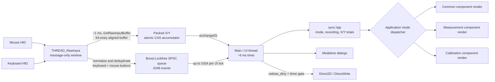
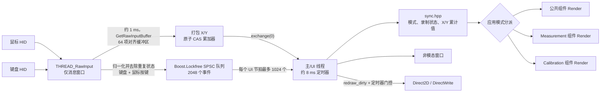

# WinMouseSensConverter

> A native Windows mouse-distance meter and DPI calibration tool based on Raw Input.  
> 基于 Windows Raw Input 的原生鼠标测距与 DPI 定标工具。

<p align="center">
  <a href="#english">English</a> · <a href="#chinese">简体中文</a>
</p>


---

<a id="english"></a>

## English

WinMouseSensConverter has two workflows. Start with the one that matches your goal; the later sections explain settings, accuracy, troubleshooting, and implementation details.

> [!IMPORTANT]
> The executable manifest requests administrator privileges. Accept the Windows UAC prompt at startup. Background capture still depends on the game, its input mode, and any anti-cheat or exclusive-input restrictions.

### Quick start

#### Measurement mode: match sensitivity between games

Use **Mode → Measurement** to measure the mouse travel required for a known in-game camera rotation. A full turn is usually expressed as **counts/360°** or **cm/360°**.

1. Set the mouse to the DPI/CPI you want to use in both games. Do not change the hardware DPI during the comparison.
2. Start WinMouseSensConverter and accept the administrator permission prompt.
3. Under **Options**, select the actual **Reference DPI**, the **Recording Key** (`F2` by default), and an output **Unit**. `cm` is convenient for 360° turns, `mm` for short distances, and `raw` for inspecting the captured counts.
4. In the baseline game, choose a repeatable camera state and a thin reference point such as a wall corner or vertical seam.
5. Aim at the reference, place the mouse at a marked starting position, and press the recording key. The start sound confirms that recording is active and the previous measurement has been cleared.
6. Rotate horizontally through the chosen angle—normally exactly 360°—until the crosshair returns to the same reference point.
7. Keep the mouse still and press the recording key again. The distinct stop sound confirms that recording has ended; the final X/Y values remain visible.
8. Repeat several times in the same direction and use the median of the consistent results as the baseline.
9. Reproduce the same camera state and angle in the target game, then adjust its sensitivity until the physical-distance result matches the baseline within a practical tolerance.

> [!WARNING]
> Move or lift the mouse back to its starting position only while recording is off. Mouse movement during the intended recording interval can contribute to the result; reports at the key-press boundary follow the sampling order explained below.

> [!TIP]
> Measuring 720° and dividing the result by two often reduces the relative effect of endpoint alignment and single-count quantization.

#### Calibration mode: measure effective DPI

Use **Mode → Calibration** to derive effective DPI from one known ruler distance and the final two-dimensional Raw Input vector.

1. Place a ruler beside the mouse and choose a long, straight section of the pad. Prefer `20 cm` or `50 cm` when space allows.
2. Choose **Mode → Calibration**.
3. Choose **Options → Calibration Distance → 10 cm / 20 cm / 50 cm**, or select **Custom...** and enter an integer from `10` through `1000`. Custom calibration input is always in centimeters.
4. Keep the mouse stationary, press the displayed recording key, and wait for the start sound.
5. Move the mouse once in a straight line by exactly the selected ruler distance. Do not lift, rotate, overshoot, reverse, or correct it.
6. Stop at the ruler mark, keep the mouse stationary, and press the recording key again. The calibrated DPI remains visible.
7. Repeat at least five times and compare the median of the consistent results. Improve the physical procedure before using a result with a large spread.

Calibration uses the final net vector:

```text
counts = sqrt(dx² + dy²)
known distance in inches = calibration_distance_cm / 2.54
calibrated DPI = counts / known distance in inches
```

> [!CAUTION]
> Calibration uses the magnitude of the final accumulated X/Y displacement, not the sum of each packet's path length. Opposite movement cancels before the magnitude is calculated, so a curved path, reversal, overshoot, or endpoint correction invalidates the ruler assumption.

The Calibration header shows `CALDIS` in the selected Unit. A physical unit displays the configured ruler distance converted to that unit; `raw` displays the counts predicted by the current Reference DPI for that ruler distance. The captured movement distance is not displayed separately.

> [!NOTE]
> Reference DPI and Unit do not enter the calibrated-DPI formula, and calibration never overwrites Reference DPI. To use the result for later physical-distance conversion, enter a suitable integer under **Options → Reference DPI → Custom...**.

Switching between Measurement and Calibration preserves the active recording state and accumulated X/Y values. It does not stop or clear the current session.

### What WinMouseSensConverter does

WinMouseSensConverter measures how far the mouse moves while an in-game camera rotates through a known horizontal angle. Repeating the same measurement in another game lets you tune that game's sensitivity until both games require the same mouse travel for the same rotation.

It is an **empirical measurement and calibration tool**, not a database-driven converter. It does not know a game's internal sensitivity formula, identify the foreground game, infer settings, modify game files, or change settings automatically. This keeps it useful across engines with different scales, rounding rules, and undocumented behavior.

The application captures raw X/Y counts in the background. Horizontal X is normally used for sensitivity matching; Y exposes unintended vertical drift.

#### Highlights

- Native Windows desktop application written in C++20.
- Buffered keyboard, mouse-button, and mouse-movement Raw Input capture on one dedicated message thread.
- Configurable background recording control without switching away from the game.
- Different notification sounds for starting and stopping recording.
- Starting clears the previous result; stopping leaves the final result visible.
- Signed X/Y measurement: right/down are positive and left/up are negative.
- Separate Measurement and Calibration renderers sharing one recording session.
- DPI calibration from a known `10`–`1000 cm` distance using the final net X/Y vector.
- Output in raw counts, inches, millimeters, centimeters, decimeters, or meters.
- Reference DPI presets: `100`, `400`, `800`, `1200`, `1600`, `3200`, and `10000`, plus modeless custom input from `1` to `999999`.
- Recording-key presets: `R`, `T`, `F2`, `F5`, `COMMA`, and `PERIOD`, plus modeless custom Windows Virtual-Key input from `1` to `254`.
- Per-user persistence for mode, Reference DPI, unit, calibration distance, and recording key.
- Responsive Per-Monitor-V2-DPI-aware Direct2D/DirectWrite interface.
- Modeless About, Instruction, and custom-setting windows that do not block input collection.
- No injection, process-memory access, network access, telemetry, or saved measurement history; only user configuration is written.

### Settings and configuration

#### Menu settings

| Setting | Available values | Default | Effect |
| --- | --- | --- | --- |
| Mode | Measurement, Calibration | Measurement | Selects the renderer and interpretation of the accumulated X/Y values. |
| Reference DPI | `100`, `400`, `800`, `1200`, `1600`, `3200`, `10000`, or Custom `1`–`999999` | `800` | Converts raw counts to physical units; does not affect calibrated DPI. |
| Unit | `raw`, `inch`, `mm`, `cm`, `dm`, `m` | `cm` | Controls displayed measurement distances and the `CALDIS` header. |
| Calibration Distance | `10`, `20`, `50 cm`, or Custom `10`–`1000 cm` | `10 cm` | Supplies the known ruler distance for calibration. |
| Recording Key | `R`, `T`, `F2`, `F5`, `COMMA`, `PERIOD`, or Custom VK `1`–`254` | `F2` | Toggles recording on a matching keyboard or physical mouse-button Raw Input key-down transition. |

Invalid custom input keeps the last valid value active. Custom windows are modeless, so the main window and input thread continue running while they are open.

#### Configuration file

Settings are loaded at startup from:

```text
%LOCALAPPDATA%\WinMouseSensConverter\config.ini
```

Choose **Options → Edit Configuration File...** to open the containing directory in File Explorer; the file itself is not opened automatically.

> [!WARNING]
> Exit WinMouseSensConverter before editing `config.ini`. On a normal exit, the application saves its in-memory settings and overwrites the file, so manual edits made while it is running are lost.

The file is UTF-8 text and may begin with a UTF-8 BOM. Its maximum accepted size is 64 KiB. The format is:

```ini
reference_dpi = 800
unit = cm
calibration_distance_cm = 10
mode = measurement
recording_key = 0x71
```

- Valid units are `raw`, `inch`, `mm`, `cm`, `dm`, and `m`.
- Valid modes are `measurement` and `calibration`.
- `reference_dpi` is a decimal integer from `1` through `999999`.
- `calibration_distance_cm` is a decimal integer from `10` through `1000`.
- Blank lines and spaces or tabs around lines, keys, `=`, and values are accepted; CRLF and LF line endings are supported.
- Key names and enum values are case-sensitive. Unknown fields are ignored.

`recording_key` accepts a Windows Virtual-Key value from `1` through `254`: decimal such as `113`, or hexadecimal such as `0x71` or `0X71`. The application writes two-digit uppercase hexadecimal. The modeless custom field accepts at most four characters: decimal `1`–`254`, or `0x`/`0X` plus one or two hexadecimal digits. The main window uses the Windows key name when available and falls back to `VK 0xNN`. Values emitted by keyboard Raw Input can trigger recording; the five physical mouse buttons are also available as `VK_LBUTTON` (`1`), `VK_RBUTTON` (`2`), `VK_MBUTTON` (`4`), `VK_XBUTTON1` (`5`), and `VK_XBUTTON2` (`6`). Menu changes take effect immediately; file edits take effect at the next startup.

Selecting a custom calibration distance keeps **Custom...** checked for the rest of the run, even when the value is `10`, `20`, or `50`. Only the number is saved; those three values map back to presets at the next startup. Custom recording keys behave the same way: Custom remains checked for the run, while saved preset values map back to their preset command after restart. Existing valid configurations, including `F1`, remain valid.

Custom Reference DPI follows the same runtime rule: a successful custom submission keeps **Custom...** checked even when the number matches a DPI preset. At the next startup, saved preset numbers map back to their preset commands and all other valid values map to Custom.

> [!IMPORTANT]
> Every documented field is required. A missing, unreadable, oversized, incomplete, duplicated, malformed, or invalid configuration restores **all** defaults (`800`, `cm`, `10 cm`, Measurement, `F2`) and triggers an attempt to replace the file. Older files without `calibration_distance_cm` or `mode` therefore reset in full. Configuration failures never prevent startup.

The save path creates the user directory when needed, writes a process-specific temporary file, flushes and closes it, then calls `MoveFileExW` with replace and write-through flags. Measurement and calibration results are never persisted.

### Understanding the result

The Measurement interface displays signed sums of Raw Input counts:

```text
X raw counts = Σ RAWMOUSE::lLastX
Y raw counts = Σ RAWMOUSE::lLastY
```

- Positive X is net movement right; negative X is net movement left.
- Positive Y is net movement down; negative Y is net movement up, following the Raw Input coordinate convention.
- Zero means no net movement on that axis; opposite movements can cancel.
- Reference DPI and Unit are applied identically to X and Y.

For cross-game matching, compare horizontal X in the same direction or compare absolute magnitudes. Use Y to reveal vertical drift. Physical units usually express a practical tolerance better than a one-count target: `cm` suits typical 360° tests, `mm` suits shorter distances, and `raw` helps diagnose the input itself.

Physical distances are derived from Reference DPI:

```text
inches      = raw counts / Reference DPI
millimeters = inches × 25.4
centimeters = inches × 2.54
decimeters  = inches × 0.254
meters      = inches × 0.0254
```

Reference DPI is only a conversion factor. Changing it does not change captured counts or measurement precision, and converting units does not remove sensor or operating error. A mouse's effective CPI can differ from its advertised setting, so absolute physical distance is only as accurate as the supplied Reference DPI. Keep the same mouse, hardware DPI, and Reference DPI throughout a cross-game comparison.

### A reliable cross-game workflow

#### 1. Control the variables

Keep these conditions stable:

- The same physical mouse and hardware DPI/CPI.
- The same Windows and mouse-driver configuration.
- The same in-game Raw Input, acceleration, smoothing, and filtering choices.
- The same camera context: hip-fire, ADS, scoped view, vehicle view, or another specific mode.
- A fixed zoom/FOV state for the behavior being matched.
- The same rotation angle and direction in every trial.

FOV does not itself define angular sensitivity, but FOV, ADS, and zoom states may use independent multipliers and feel visually different. Measure each state you care about separately.

#### 2. Prefer a long measurement

A 360° turn is intuitive, but two or more full turns reduce the relative influence of endpoint alignment and count quantization. Use a stable posture and enough pad space. If lifting is unavoidable, lift and landing can change the mouse angle or introduce counts; one uninterrupted sweep is preferable.

#### 3. Repeat and summarize

Use at least five trials when accuracy matters. Discard a result only when you can identify an error, such as overshooting the landmark or hitting the pad edge. Prefer the **median**, and inspect the spread: a precise average of an unstable procedure is not a reliable baseline.

#### 4. Estimate the next sensitivity

For games whose camera rotation is approximately proportional to the sensitivity value, let:

- `B` = absolute baseline distance for the chosen angle;
- `T` = absolute distance currently measured in the target game;
- `S` = current target-game sensitivity.

Use the same output unit for `B` and `T`. Then try:

```text
new sensitivity ≈ S × T / B
```

If the target needs more counts than the baseline, its sensitivity is too low and the estimate increases it. Games may round settings or use nonlinear scales, so always measure again.

### Principles, error analysis, and troubleshooting

#### Raw Input behavior

Windows defines `RAWMOUSE::lLastX` and `lLastY` as signed displacement. Relative reports describe motion since the previous report. Unlike legacy `WM_MOUSEMOVE` cursor messages, Raw Input mouse movement is not affected by the pointer speed and acceleration configured in Windows Control Panel. See Microsoft's [RAWMOUSE documentation](https://learn.microsoft.com/en-us/windows/win32/api/winuser/ns-winuser-rawmouse) and [Raw Input overview](https://learn.microsoft.com/en-us/windows/win32/inputdev/about-raw-input).

The input thread registers keyboard and mouse Raw Input to one message-only window with `RIDEV_INPUTSINK`, so it can receive background reports without suppressing normal legacy keyboard or mouse messages. Reports are not filtered by `RAWINPUTHEADER::hDevice`, so all mouse devices contribute button events and all relative mouse devices contribute movement; absolute-position and zero-movement reports do not contribute movement.

#### Recording boundaries

At each UI polling boundary, keyboard and mouse-button events are applied before the pending mouse snapshot is sampled. Starting recording clears the displayed totals and then attributes that pending snapshot to the new session. Stopping turns recording off before the pending snapshot is drained, so that snapshot is discarded.

Keyboard, mouse-button, and movement reports share one Raw Input drain, but the UI still applies all pending key events before sampling the complete pending mouse snapshot. Keep the mouse stationary while pressing the recording key; otherwise movement from the same UI polling interval may fall inside or outside the intended recording interval.

#### Sources of measurement error

Small differences between repeated raw-count measurements are normal and do not by themselves indicate a concurrent-accumulation loss.

| Category | Possible cause | Effect |
| --- | --- | --- |
| Reference-angle error | The crosshair does not return to the same pixel; the reference is broad; the target is overshot and corrected; animation or camera shake changes the view. | The real rotation angle differs between trials. |
| Start/stop timing | The mouse is still moving at a key press; motion starts before the sound; independent streams reach different UI polling boundaries. | Boundary packets can fall inside or outside the trial. |
| Mouse path and posture | Wrist/arm posture changes; the mouse yaws; a nominally horizontal path becomes an arc. | Sensor X counts vary even when hand travel looks similar. |
| Ruler alignment | The ruler is not aligned with sensor travel; marks are broad; different shell reference points are used. | The supplied distance differs from the sensor's net displacement. |
| Reversal and correction | The path curves, overshoots, reverses, or is corrected; calibration uses the final vector, not path length. | Vector length no longer represents ruler travel reliably. |
| Lift and reset | Lift-off/landing produces motion, changes mouse angle, or the sensor continues tracking near lift height. | Counts are added or omitted and repeatability falls. |
| Sensor and surface | Effective CPI deviation, quantization, noise, angle snapping, smoothing, acceleration, lens contamination, or inconsistent pad material. | Physical conversion gains systematic bias and raw values can vary. |
| Polling and packetization | USB polling and driver scheduling divide motion into different Raw Input packets. | Boundary ownership can vary; packetization alone should not change a complete stable movement's total. |
| Game behavior | Raw-input mode, acceleration, smoothing, FOV/zoom, ADS multipliers, frame-dependent input, rounding, or nonlinear scales differ. | Equal numeric settings need not mean equal angular sensitivity. |
| Other devices | A second mouse, touchpad emulator, KVM, or virtual mouse also sends relative reports. | Unrelated movement contaminates the accumulated result. |

#### Reducing error

- Choose a practical physical unit: usually `cm` for 360° and `mm` for shorter movement; do not chase precision below the procedure's repeatability.
- Keep the mouse, hardware DPI, USB connection, pad, grip, posture, and direction unchanged.
- Let the sensor and wireless connection reach stable operation before collecting a baseline.
- Use a narrow, high-contrast landmark and disable camera shake where possible.
- Measure 360° or multiple full turns instead of a small angle.
- Hold the mouse still at each key press and begin motion only after the start sound.
- For calibration, align the same physical point on the mouse to thin ruler marks and make one long, straight, uncorrected sweep.
- Reset the mouse only while recording is off.
- Compare multiple trials with the median; investigate outliers and a wide range instead of hiding them in an average.
- Calibrate hip-fire, ADS, zoom levels, vehicles, and other separately controlled views independently.
- Disconnect or immobilize other pointing devices during measurement.

#### Limitations and compatibility

- Windows 10 and Windows 11 only.
- Only relative mouse reports are measured; absolute-coordinate devices are ignored.
- Relative reports from all mouse devices are merged; a specific mouse cannot be selected.
- Both X and Y are displayed; horizontal X is the intended cross-game comparison.
- The application does not identify games, infer settings, or modify game configuration.
- Measurements are neither saved nor exported; a new recording replaces the previous result.
- Calibrated DPI is display-only and does not update Reference DPI or persist as a result.
- Games, anti-cheat systems, remote desktop, virtual machines, drivers, overlays, or exclusive-input modes may prevent background input or recording-key control.
- Matching travel for a chosen rotation cannot make different FOV, animation, recoil, or aim-assist systems feel identical.

#### Troubleshooting

**The configured key does not start or stop recording**

- Confirm that UAC was accepted and the application remains open.
- Confirm that the displayed key matches `recording_key` and that the keyboard or supported physical mouse button actually emits that VK value.
- Test on the Windows desktop to distinguish game compatibility from application startup.
- Check the game, overlays, keyboard utilities, remote desktop, drivers, and anti-cheat interception.
- Input-thread registration failures are not shown as a separate UI error; a responsive window with no keyboard or mouse data can indicate that a capture thread did not start.

**Converted centimeters do not match a ruler**

Reference DPI is mathematical input. Advertised `800 DPI` can differ from effective CPI, and the surface or firmware may add bias. Keeping the same mouse, hardware DPI, and Reference DPI still supports practical cross-game matching; independently calibrate effective CPI when the display must agree accurately with a ruler.

**Repeated trials differ by a few counts**

Endpoint alignment, discrete sensor counts, mouse angle, and boundary timing all contribute. Use longer rotations, keep the mouse still at each key press, and compare the median.

**Calibrated DPI differs between runs**

Use a longer ruler distance, the same shell reference point at both endpoints, and one straight movement without yaw, lifting, reversal, or correction. Effective CPI can also vary with surface, firmware, speed, and hardware DPI step.

**Changing Reference DPI does not change calibrated DPI**

Calibration divides the raw vector magnitude by the ruler distance in inches. Reference DPI only affects Measurement conversion and the raw-equivalent `CALDIS` display.

**The result is negative**

The sign indicates direction. Move in the same direction in both games or compare absolute values.

**Moving another mouse changes the value**

All relative mouse reports are merged. Keep secondary mice, touchpad emulators, KVM devices, and virtual-mouse tools still.

### Developer guide

#### Architecture



The program has two principal execution contexts:

1. **Combined Raw Input thread** — owns one message-only window registered for keyboard and mouse input, drains relative movement into a packed atomic accumulator, and produces normalized, deduplicated keyboard and mouse-button transitions for one SPSC consumer.
2. **Main/UI thread** — handles window and modeless-dialog messages, consumes key events then mouse movement on an approximately 8 ms timer, updates shared state, and renders exactly one mode.

The input thread starts once during static initialization. A promise/future handshake completes only after keyboard and mouse Raw Input registration succeeds or reports failure. Shutdown posts `WM_QUIT`, joins the thread, unregisters both Raw Input devices, and destroys the message-only window. Menu and paint paths do not perform input-thread joins or other blocking work.

#### Buffered input and concurrency

The named input thread deliberately excludes `WM_INPUT` from its wake mask, waits up to approximately 1 ms so reports can accumulate, and repeatedly drains `GetRawInputBuffer` through a fixed 64-entry, 8-byte-aligned array. Control messages are dispatched separately. A failed wait or buffer drain retries after 1 ms.

Mouse X/Y deltas are packed into one `std::atomic<uint64_t>`. The producer adds each relative packet with a compare-and-swap loop; the UI consumer takes and clears both axes with `exchange(0, std::memory_order_relaxed)`. If CAS races with exchange, it either completes before the snapshot or retries from the cleared state, placing the packet in the current or next snapshot without a producer/consumer update loss. This guarantee does not remove physical, sensor, game, or boundary error.

The keyboard path splits generic Shift, Control, and Alt reports into left/right VK variants and ignores `VKey == 255`. Mouse left, right, middle, XBUTTON1, and XBUTTON2 transitions are converted to `VK_LBUTTON`, `VK_RBUTTON`, `VK_MBUTTON`, `VK_XBUTTON1`, and `VK_XBUTTON2`; vertical and horizontal wheel movement is not enqueued. Keyboard and mouse-button transitions share the same atomic 256-key state table, so unchanged states from either source are suppressed. Generic configured modifier values match either side; side-specific values match only that side. The input thread pushes transitions into a capacity-2048 Boost.Lockfree SPSC queue. The main thread pops at most 1024 per UI tick and toggles only on matching key-down events. If the queue is full, that event is dropped while the key-state table remains current; an extremely overloaded queue can therefore miss a recording toggle.

#### State, rendering, and dialogs

`sync.hpp` keeps cross-mode runtime state in `app_data`: the recording flag, current mode, and accumulated X/Y totals. `app_func::toggle_recording` centralizes recording transitions, clears the totals only when recording starts, and plays the corresponding start or stop sound. Mode changes also update the persisted `UserConfig`, but they do not create a second state container or reset active measurement data.

Window, menu, DPI, display, sizing, paint, and input events only mark `UiState::redraw_dirty`. Actual Direct2D rendering occurs in `finish_main_loop_iteration` only on the main 8 ms timer, skips interactive sizing and minimized windows, and clears the flag after a successful frame. Device-dependent resources are recreated when necessary. DirectWrite layout caches reuse text layouts and scale long header/numeric content to fit. The default client size is `1280 × 720` DIPs and the minimum is `640 × 360` DIPs; the manifest selects Per-Monitor V2 DPI awareness.

Measurement values use three decimal places, normalize converted magnitudes smaller than `0.0005` to displayed zero, and switch to scientific notation for non-finite or extremely large values. Calibration shows `— DPI` before any movement, normally uses two decimal places, and also falls back to scientific notation for extremely large results. The two Measurement cards share the smaller calculated fit scale so X and Y retain consistent typography.

The UI uses a portable C++20 header-only component library under `D2DUILIB`. One window-level `D2duiContext` owns and caches the Direct2D/DirectWrite resources. The application keeps three persistent component queues: common, Measurement, and Calibration. Each frame opens one Direct2D transaction, draws the common queue followed by exactly one mode queue, and closes that transaction. Switching modes neither recreates components nor duplicates the cross-mode state. About, Instruction, custom DPI, custom calibration-distance, and custom recording-key windows remain modeless and are routed through `ui::preprocess_modeless_dialog_message`.

#### Configuration lifecycle

`WinMain` loads or creates `UserConfig` before creating the main window, copies its mode into the shared runtime state, and gives the UI a reference to the same configuration object. Menu and successful custom-input actions update that object immediately. The normal message-loop exit serializes it once more; configuration I/O failure is deliberately non-fatal. **Edit Configuration File...** resolves the per-user directory and launches File Explorer asynchronously instead of performing blocking file work in the menu handler.

#### Repository layout

| Path | Purpose |
| --- | --- |
| `WinMouseSensConverter/WinMouseSensConverter.cpp` | `WinMain`, configuration lifetime, and the main message/consumer loop. |
| `WinMouseSensConverter/SYS/low_latency_input.hpp` | Combined buffered Raw Input thread, shared key-state table and SPSC event queue, and packed atomic movement accumulator. |
| `WinMouseSensConverter/SYS/low_latency_mousemov.hpp` | Retained legacy mouse implementation; not included by the application. |
| `WinMouseSensConverter/SYS/low_latency_keyboard.hpp` | Retained legacy keyboard implementation; not included by the application. |
| `WinMouseSensConverter/config.hpp` | Header-only parsing, validation, loading, default recovery, and atomic-style save replacement. |
| `WinMouseSensConverter/sync.hpp` | Shared `app_data` state and centralized `app_func` recording transitions. |
| `WinMouseSensConverter/ui.cpp` | Input consumption, recording transitions, lifecycle, menus, dialogs, DPI handling, and timer-gated dispatch. |
| `WinMouseSensConverter/ui_view.hpp/.cpp` | Application formatting, responsive layout, and common/Measurement/Calibration render orchestration. |
| `WinMouseSensConverter/D2DUILIB/` | Migratable header-only Direct2D/DirectWrite context, render queue, base interface, and reusable components. |
| `WinMouseSensConverter/WinMouseSensConverter.rc` | UTF-8 icons, dialogs, strings, and version resources. |
| `WinMouseSensConverter/WinMouseSensConverter.manifest` | Per-Monitor V2 awareness and administrator execution level. |
| `WinMouseSensConverterAutomaticTest/` | Non-elevated x64 console tests and independent runner. |
| `build_windows.ps1` | Visual Studio discovery and x64 MSBuild entry point. |

#### Build from source

The normal build and validation workflow supports **x64 only**. Win32/x86 configurations are not documented or supported here.

Requirements:

- Windows 10 or Windows 11.
- PowerShell.
- Visual Studio with MSBuild, the MSVC `v145` C++ toolset, Windows 10 SDK, and **Desktop development with C++**.
- `vswhere.exe`, normally installed by Visual Studio Installer.
- [vcpkg](https://github.com/microsoft/vcpkg) using classic MSBuild integration.
- Boost.Lockfree headers for the `x64-windows` triplet.

The repository intentionally has no `vcpkg.json`. Install and integrate its only third-party build dependency when needed:

```powershell
vcpkg install boost-lockfree:x64-windows
vcpkg integrate install
```

Direct2D and DirectWrite come from the Windows SDK through `d2d1.lib` and `dwrite.lib`. Boost.Lockfree is header-only for this application, so there is no additional third-party runtime-library requirement.

Run from the repository root and keep `-NoRestore` for normal builds after dependencies are installed:

```powershell
# Debug x64
.\build_windows.ps1 -Configuration Debug -Platform x64 -NoRestore

# Release x64
.\build_windows.ps1 -Configuration Release -Platform x64 -NoRestore
```

Use `-Clean` only for a needed clean rebuild. The script uses `vswhere.exe` to find a suitable Visual Studio, initializes its developer environment, and invokes MSBuild for the `.slnx` solution. The normal artifact is:

```text
x64\Release\WinMouseSensConverter.exe
```

Running it triggers UAC because the application manifest requires administrator privileges.

#### Automated tests

The solution's self-contained test executable is a console application without the main administrator manifest. It runs as the current user and never starts the main executable.

The runner builds by default. Use `-NoBuild` only after the selected configuration has already been built.

```powershell
# Build and run Debug x64 tests
.\WinMouseSensConverterAutomaticTest\run_tests.ps1 -Configuration Debug

# Build and run Release x64 tests
.\WinMouseSensConverterAutomaticTest\run_tests.ps1 -Configuration Release

# Run an already-built configuration
.\WinMouseSensConverterAutomaticTest\run_tests.ps1 -Configuration Debug -NoBuild
```

Tests cover configuration parsing and serialization, recording-state transitions, unit and calibration calculations, component ownership and behavior, the three-render contract, and DirectWrite layout reuse. Recording-transition tests suppress notification sounds. Rendering tests create only a hidden ordinary test window; they do not create Raw Input threads, access saved user configuration, require physical devices, or start the elevated main executable.

#### Contributing

Issues and pull requests are welcome. Preserve the combined Raw Input thread, its shared key-state deduplication and single-producer/single-consumer design, keep cross-mode state in `sync.hpp`, keep mode renderers isolated, and avoid reciprocal include dependencies. Do not add blocking waits, file/network operations, modal dialogs, or thread joins to menu or paint paths. Visible-state events must only mark the redraw dirty; keep rendering in the timer-gated main-loop path. Help windows must remain modeless, resource scripts must remain UTF-8 with `#pragma code_page(65001)`, and relevant changes must pass both Debug x64 and Release x64 validation.

#### License

WinMouseSensConverter is distributed under the [GNU Affero General Public License, version 3 or later](LICENSE.txt).

---

<a id="chinese"></a>

## 简体中文

WinMouseSensConverter 提供两种使用流程。请先按目标选择对应模式；后续章节再逐步说明设置、精度、排错和代码实现。

> [!IMPORTANT]
> 程序清单要求以管理员权限运行，请在启动时接受 Windows UAC 提示。能否在后台捕获输入，仍取决于游戏输入模式、反作弊机制和独占输入限制。

### 快速上手

#### 测量模式：匹配不同游戏的灵敏度

使用 **Mode → Measurement** 测量游戏视角旋转已知水平角度所需的鼠标距离。最常见的是一整圈，通常记作 **counts/360°** 或 **cm/360°**。

1. 将鼠标设置为两款游戏都要使用的 DPI/CPI；比较期间不要切换硬件 DPI。
2. 启动 WinMouseSensConverter，并接受管理员权限提示。
3. 在 **Options** 中选择实际的 **Reference DPI**、录制按键 **Recording Key**（默认 `F2`）和输出单位 **Unit**。360° 测量通常使用 `cm`，短距离使用 `mm`，检查底层计数时使用 `raw`。
4. 在基准游戏中固定可重复的视角状态，并选择墙角、竖直接缝等细窄参照物。
5. 将准星对准参照物，把鼠标放在标记好的起点，然后按下录制键。开始提示音表示录制已开启，旧测量值已经清零。
6. 水平旋转指定角度——通常恰好为 360°——直到准星回到同一参照点。
7. 保持鼠标静止，再次按下录制键。不同的停止提示音表示录制已结束，最终 X/Y 值会保留在界面中。
8. 沿相同方向重复多次，以一致结果的中位数作为基准。
9. 在目标游戏中复现相同的视角状态和角度，调整灵敏度，直到物理距离结果在合理容差内与基准一致。

> [!WARNING]
> 只在停止录制后移动或抬起鼠标复位。预期录制区间内的鼠标移动都可能参与结果；按键边界处的数据包按下文说明的采样顺序归属。

> [!TIP]
> 测量 720° 再把结果除以二，通常可以降低端点对齐和单个 count 量化误差所占的相对比例。

#### 定标模式：测量有效 DPI

使用 **Mode → Calibration**，根据已知尺子距离和最终二维 Raw Input 向量计算鼠标的有效 DPI。

1. 把尺子放在鼠标旁，在鼠标垫上选择尽可能长且笔直的区域；空间允许时优先使用 `20 cm` 或 `50 cm`。
2. 选择 **Mode → Calibration**。
3. 选择 **Options → Calibration Distance → 10 cm / 20 cm / 50 cm**，或选择 **Custom...** 并输入 `10`～`1000` 的整数。自定义定标距离始终以厘米为单位。
4. 保持鼠标静止，按下界面显示的录制键，等待开始提示音。
5. 沿直线一次性移动恰好等于所选尺子距离；不要抬鼠、旋转、越过终点、反向或回调修正。
6. 到达尺子刻度后保持静止，再次按下录制键；最终定标 DPI 会保留在界面中。
7. 至少重复五次，比较一致结果的中位数。如果离散范围很大，应先改善操作流程再使用结果。

定标使用最终净向量：

```text
counts = sqrt(dx² + dy²)
已知距离（英寸）= calibration_distance_cm / 2.54
定标 DPI = counts / 已知距离（英寸）
```

> [!CAUTION]
> 定标计算的是最终累计 X/Y 位移的向量长度，而不是各数据包路径长度之和。相反方向移动会先抵消，因此弯曲轨迹、反向、越过终点或回调修正都会破坏“尺子距离等于净位移”的前提。

Calibration 顶部的 `CALDIS` 使用当前 Unit 显示目标定标距离：物理单位下显示尺子距离的对应换算值，`raw` 下显示当前 Reference DPI 对该距离预测的等效 counts。界面不会单独显示采集到的实测距离。

> [!NOTE]
> Reference DPI 和 Unit 都不参与定标 DPI 公式，定标结果也不会覆盖 Reference DPI。如需用定标结果进行后续物理距离换算，请在 **Options → Reference DPI → Custom...** 中手工输入合适的整数。

在 Measurement 与 Calibration 之间切换会保留当前录制状态和累计 X/Y 值，不会停止或清除当前记录。

### WinMouseSensConverter 能做什么

WinMouseSensConverter 测量鼠标在游戏视角完成已知水平旋转角度时移动了多远。在另一款游戏中重复同样测量，即可调整其灵敏度，使两款游戏完成相同旋转所需的鼠标距离一致。

它是一个**实测型测量与定标工具**，不是依赖数据库的换算器。它不会读取游戏内部灵敏度公式、识别前台游戏、推断设置、修改游戏文件或自动调整参数，因此也能适用于使用不同引擎、刻度、舍入规则或未公开算法的游戏。

程序在后台采集并显示 X/Y 原始计数。跨游戏匹配通常使用水平 X，Y 则用于发现意外的垂直偏移。

#### 功能特性

- 使用 C++20 编写的原生 Windows 桌面程序。
- 键盘、鼠标按键和鼠标移动由一条独立消息线程批量采集 Raw Input。
- 可在不切回程序的情况下通过可配置录制键控制后台记录。
- 开始和停止录制使用不同提示音。
- 开始新录制会清除旧结果，停止后最终结果继续显示。
- 同时显示有符号 X/Y：右/下为正，左/上为负。
- Measurement 与 Calibration 使用隔离的渲染器，但共享同一录制会话。
- 根据 `10`～`1000 cm` 已知距离和最终 X/Y 净向量定标 DPI。
- 支持 raw counts、英寸、毫米、厘米、分米和米。
- Reference DPI 预设为 `100`、`400`、`800`、`1200`、`1600`、`3200`、`10000`，并提供 `1`～`999999` 的非模态自定义输入。
- 录制键预设为 `R`、`T`、`F2`、`F5`、`COMMA`、`PERIOD`，并提供 `1`～`254` 的 Windows Virtual-Key 非模态自定义输入。
- 按用户保存模式、Reference DPI、单位、定标距离和录制键。
- 基于 Direct2D/DirectWrite 的响应式 Per-Monitor V2 DPI 感知界面。
- “关于”、“使用说明”和自定义设置窗口均为非模态窗口，不阻塞输入采集。
- 不注入游戏、不读取进程内存、不访问网络、不含遥测、不保存测量历史；只写入用户配置。

### 设置与配置

#### 菜单设置

| 设置 | 可选值 | 默认值 | 作用 |
| --- | --- | --- | --- |
| Mode | Measurement、Calibration | Measurement | 选择渲染器和累计 X/Y 值的解释方式。 |
| Reference DPI | `100`、`400`、`800`、`1200`、`1600`、`3200`、`10000`，或 Custom `1`～`999999` | `800` | 将 raw counts 换算成物理单位；不影响定标 DPI。 |
| Unit | `raw`、`inch`、`mm`、`cm`、`dm`、`m` | `cm` | 控制测量距离和 `CALDIS` 顶部字段的显示单位。 |
| Calibration Distance | `10`、`20`、`50 cm`，或 Custom `10`～`1000 cm` | `10 cm` | 为定标公式提供已知尺子距离。 |
| Recording Key | `R`、`T`、`F2`、`F5`、`COMMA`、`PERIOD`，或 Custom VK `1`～`254` | `F2` | 在收到匹配的键盘或物理鼠标按键 Raw Input 按下状态变化时切换录制。 |

自定义输入无效时会保留最后一个合法值。自定义窗口是非模态的，打开期间主窗口和输入线程仍继续运行。

#### 配置文件

程序启动时从以下位置读取设置：

```text
%LOCALAPPDATA%\WinMouseSensConverter\config.ini
```

选择 **Options → Edit Configuration File...** 会在文件资源管理器中打开所在目录，不会自动打开配置文件本身。

> [!WARNING]
> 请先退出 WinMouseSensConverter 再编辑 `config.ini`。正常退出时，程序会用内存中的当前设置覆盖该文件，因此运行期间进行的手工编辑会丢失。

配置文件为 UTF-8 文本，可以带 UTF-8 BOM，允许的最大文件大小为 64 KiB。格式如下：

```ini
reference_dpi = 800
unit = cm
calibration_distance_cm = 10
mode = measurement
recording_key = 0x71
```

- 合法单位为 `raw`、`inch`、`mm`、`cm`、`dm`、`m`。
- 合法模式为 `measurement` 和 `calibration`。
- `reference_dpi` 是 `1`～`999999` 的十进制整数。
- `calibration_distance_cm` 是 `10`～`1000` 的十进制整数。
- 允许空行，以及行、键、`=`、值两侧的空格或制表符；支持 CRLF 和 LF 换行。
- 键名和枚举值区分大小写；未知字段会被忽略。

`recording_key` 接受 `1`～`254` 的 Windows Virtual-Key 数值，可以使用 `113` 这样的十进制，也可以使用 `0x71` 或 `0X71` 这样的十六进制。程序保存时统一写为两位大写十六进制。非模态自定义输入框最多接受四个字符：十进制 `1`～`254`，或 `0x`/`0X` 后跟一至两位十六进制数字。主界面优先显示 Windows 提供的按键名称，无法取得时显示 `VK 0xNN`。键盘 Raw Input 实际产生的 VK 值可以触发录制；五个物理鼠标键也分别可用 `VK_LBUTTON`（`1`）、`VK_RBUTTON`（`2`）、`VK_MBUTTON`（`4`）、`VK_XBUTTON1`（`5`）和 `VK_XBUTTON2`（`6`）配置。菜单修改立即生效；手工文件修改在下次启动时生效。

选择自定义定标距离后，即使输入 `10`、`20` 或 `50`，本次运行也会保持 **Custom...** 选中；保存时只写数值，下次启动时这三个值会重新映射到预设。自定义录制键采用同样规则：本次运行保持 Custom，重启后已保存的预设值重新映射到预设命令。现有合法配置（包括 `F1`）仍然有效。

自定义 Reference DPI 也遵循同样的本次运行规则：成功提交后即使数值与 DPI 预设相同，也会保持 **Custom...** 选中。下次启动时，已保存的预设数值重新映射到预设命令，其他合法值映射到 Custom。

> [!IMPORTANT]
> 每个已记录字段都是必填项。文件缺失、无法读取、超过大小限制、字段不完整或重复、行格式错误、值无效时，程序都会恢复**全部**默认值（`800`、`cm`、`10 cm`、Measurement、`F2`），并尝试替换配置文件。因此，缺少 `calibration_distance_cm` 或 `mode` 的旧配置会整体重置。配置失败不会阻止程序启动。

保存时会按需创建用户目录，写入带进程 ID 的临时文件并刷新、关闭，然后用带替换和写穿标志的 `MoveFileExW` 更新目标文件。测量与定标结果从不持久化。

### 理解测量结果

Measurement 界面显示两个方向的 Raw Input 有符号计数总和：

```text
X raw counts = Σ RAWMOUSE::lLastX
Y raw counts = Σ RAWMOUSE::lLastY
```

- X 为正表示净位移向右，X 为负表示净位移向左。
- Y 为正表示净位移向下，Y 为负表示净位移向上，与 Raw Input 坐标方向一致。
- 某个轴为零表示该轴没有净位移；相反方向的移动可能互相抵消。
- Reference DPI 和 Unit 会以相同方式应用到 X 与 Y。

跨游戏匹配应比较相同方向的水平 X，或比较绝对值；Y 用于发现垂直偏移。物理单位通常比追求单个 count 更适合表达实际容差：常规 360° 使用 `cm`，短距离使用 `mm`，排查输入数据时使用 `raw`。

程序通过 Reference DPI 换算物理距离：

```text
英寸 = raw counts / Reference DPI
毫米 = 英寸 × 25.4
厘米 = 英寸 × 2.54
分米 = 英寸 × 0.254
米   = 英寸 × 0.0254
```

Reference DPI 只是换算系数。修改它不会改变已经捕获的 counts 或测量精度，换算单位也不会消除传感器或操作误差。鼠标有效 CPI 可能偏离标称值，因此绝对物理距离的准确度取决于提供的 Reference DPI。跨游戏比较全过程应保持同一只鼠标、硬件 DPI 和 Reference DPI。

### 可靠的跨游戏测量流程

#### 1. 控制变量

保持以下条件稳定：

- 同一只实体鼠标和相同硬件 DPI/CPI。
- 相同的 Windows 与鼠标驱动设置。
- 相同的游戏 Raw Input、加速度、平滑和滤波选项。
- 相同的视角场景：腰射、ADS、瞄准镜、载具视角或其他特定模式。
- 与目标手感对应的固定缩放/FOV 状态。
- 每次采用相同旋转角度和方向。

FOV 本身不直接定义角灵敏度，但 FOV、ADS 和缩放状态可能使用独立倍率，视觉感受也不同。应分别测量每一种关心的状态。

#### 2. 优先使用较长的测量距离

360° 最直观，但连续旋转两圈或更多圈可以降低端点对齐和计数量化误差所占的相对比例。保持稳定姿势并预留足够鼠标垫空间。如果不得不抬鼠，抬起和落下可能改变鼠标角度或产生计数；应尽量一次连续完成。

#### 3. 重复测量并汇总

对精度有要求时至少测量五次。只有能确认越过参照点、撞到鼠标垫边缘等操作错误时才丢弃结果。优先使用**中位数**，同时观察离散范围；不稳定流程算出的精确平均值并不是可靠基准。

#### 4. 估算下一次灵敏度

对于视角旋转与灵敏度数值近似成正比的游戏，定义：

- `B`：指定角度的基准距离绝对值；
- `T`：目标游戏当前测得的距离绝对值；
- `S`：目标游戏当前灵敏度。

`B` 与 `T` 必须使用相同单位。下一次可尝试：

```text
新灵敏度 ≈ S × T / B
```

如果目标游戏需要更多 counts，其当前灵敏度偏低，公式会提高估算值。游戏可能舍入设置或使用非线性刻度，因此修改后必须重新实测。

### 原理、误差分析与排错

#### Raw Input 行为

Windows 将 `RAWMOUSE::lLastX` 和 `lLastY` 定义为有符号位移；相对报告表示自上一报告以来的移动。与传统 `WM_MOUSEMOVE` 光标消息不同，Raw Input 鼠标移动不受 Windows 控制面板指针速度和加速度影响。参见 Microsoft 的 [RAWMOUSE 文档](https://learn.microsoft.com/en-us/windows/win32/api/winuser/ns-winuser-rawmouse)和 [Raw Input 概述](https://learn.microsoft.com/en-us/windows/win32/inputdev/about-raw-input)。

输入线程把键盘和鼠标 Raw Input 注册到同一个带 `RIDEV_INPUTSINK` 的 message-only window，因此能够在后台接收报告，同时不会抑制普通传统键盘或鼠标消息。程序不按 `RAWINPUTHEADER::hDevice` 过滤报告，所以所有鼠标设备都会贡献按键事件、所有相对鼠标设备都会贡献移动；绝对坐标和零位移报告不计入移动。

#### 录制边界

每个 UI 轮询边界都会先处理键盘和鼠标按键事件，再提取待处理鼠标快照。开始录制会清空显示累计值，然后把该待处理快照归入新记录；停止录制会先关闭记录，再提取并丢弃该快照。

键盘、鼠标按键和移动报告由同一次 Raw Input 排空处理，但 UI 仍先应用所有待处理按键事件，再提取完整的待处理鼠标快照。按录制键时应保持鼠标静止，否则同一 UI 轮询区间内的移动可能落在预期录制区间内或区间外。

#### 测量误差来源

重复测量存在少量 raw counts 差异是正常现象，并不直接表示并发累加发生漏计。

| 类别 | 可能原因 | 影响 |
| --- | --- | --- |
| 参照角度误差 | 准星没有回到同一像素；参照物太宽；越过目标后回调；动画或镜头晃动改变视角。 | 每次实际旋转角度不同。 |
| 人为起止时机 | 按键时鼠标仍在移动；在提示音前提前动作；独立输入流到达不同 UI 轮询边界。 | 边界数据包可能进入或离开测量。 |
| 鼠标轨迹与姿态 | 手腕/手臂姿势改变；鼠标自身偏转；水平移动变成弧线。 | 即使手部距离相似，传感器 X 计数也会变化。 |
| 尺子与端点对齐 | 尺子与传感器方向不一致；刻度太宽；两端使用不同外壳参照点。 | 输入距离与传感器净位移不一致。 |
| 反向与回调 | 轨迹弯曲、越界、反向或修正；定标只取最终向量，不累计路径长度。 | 向量长度无法可靠代表尺子路径。 |
| 抬鼠与复位 | 抬起/落下产生位移、改变鼠标角度，或传感器在接近抬升高度时继续跟踪。 | 增加或遗漏 counts，降低重复性。 |
| 传感器与表面 | 有效 CPI 偏差、计数量化、噪声、角度修正、平滑、加速度、镜头污渍或鼠标垫不一致。 | 物理换算产生系统偏差，raw 值也可能波动。 |
| 轮询与数据分包 | USB 轮询和驱动调度把运动划分成不同 Raw Input 数据包。 | 边界归属可能变化；单纯改变分包通常不应改变完整稳定移动的总计数。 |
| 游戏行为 | Raw Input、加速度、平滑、FOV/缩放、ADS 倍率、帧相关输入、舍入或非线性刻度不同。 | 相同数值不等于相同角灵敏度。 |
| 其他输入设备 | 第二只鼠标、触控板模拟器、KVM 或虚拟鼠标也产生相对报告。 | 无关移动污染累计结果。 |

#### 降低误差的方法

- 选择有实际意义的物理单位：360° 通常使用 `cm`，短距离使用 `mm`；不要追求低于流程重复能力的精度。
- 保持鼠标、硬件 DPI、USB 连接、鼠标垫、握姿、姿势和移动方向不变。
- 采集基准前让传感器和无线连接进入稳定状态。
- 使用细窄、高对比度参照物，并尽量关闭镜头晃动。
- 测量 360° 或多圈，不要只测很小的角度。
- 每次按录制键时保持鼠标静止，听到开始提示音后再移动。
- 定标时用鼠标上的同一物理点对齐细窄刻度，完成一次尽可能长、笔直且不修正的移动。
- 只在停止录制后复位鼠标。
- 使用多次测量的中位数；调查异常值和较大极差，不要用平均值掩盖问题。
- 对腰射、ADS、各缩放倍率、载具等独立控制视角分别定标。
- 测量期间断开其他指针设备或确保其完全不动。

#### 限制与兼容性

- 仅支持 Windows 10 和 Windows 11。
- 只测量相对鼠标报告；绝对坐标设备会被忽略。
- 所有鼠标设备的相对报告会被合并，不能选择特定鼠标。
- 界面同时显示 X 与 Y；跨游戏比较使用水平 X。
- 程序不会识别游戏、推断设置或修改游戏配置。
- 测量不保存也不导出；开始新记录会替换旧结果。
- 定标 DPI 只用于显示，不会更新 Reference DPI，也不会作为结果持久化。
- 游戏、反作弊、远程桌面、虚拟机、驱动、覆盖层或独占输入模式可能阻止后台输入或录制键控制。
- 匹配指定旋转所需距离，无法让不同 FOV、动画、后坐力或辅助瞄准产生完全相同的主观手感。

#### 常见问题

**配置的按键无法开始或停止录制**

- 确认已经接受 UAC 提示，且程序仍在运行。
- 确认界面显示的按键与 `recording_key` 一致，并且键盘或受支持的物理鼠标键确实产生该 VK 值。
- 先在 Windows 桌面测试，以区分游戏兼容性与程序启动问题。
- 检查游戏、覆盖层、键盘工具、远程桌面、驱动或反作弊是否拦截输入。
- 输入线程注册失败不会显示独立错误提示；如果窗口正常响应但完全没有键盘或鼠标数据，可能是采集线程没有启动。

**换算出的厘米数与尺子不一致**

Reference DPI 是数学输入。标称 `800 DPI` 可能偏离有效 CPI，表面或固件也可能带来偏差。只要跨游戏过程中保持同一只鼠标、硬件 DPI 和 Reference DPI，仍可进行实用匹配；只有要求显示值精确对应尺子时，才需要独立定标有效 CPI。

**重复测量相差几个 counts**

端点对齐、传感器离散计数、鼠标角度和边界时机会共同产生差异。请使用更长旋转、在每次按键时保持静止，并比较中位数。

**每次定标得到的 DPI 不一样**

使用更长的尺子距离，在两端使用同一外壳参照点，并进行一次不偏转、不抬起、不反向、不修正的直线移动。有效 CPI 也可能随表面、固件、速度和硬件 DPI 档位变化。

**修改 Reference DPI 不会改变定标 DPI**

定标公式直接用原始向量长度除以尺子的英寸距离。Reference DPI 只影响 Measurement 换算和 `CALDIS` 的 raw 等效显示。

**结果是负数**

符号表示移动方向。两款游戏采用相同方向，或比较绝对值即可。

**移动另一只鼠标也会改变数值**

程序会合并全部相对鼠标报告。请保持第二只鼠标、触控板模拟器、KVM 和虚拟鼠标工具静止。

### 开发者指南

#### 架构



程序有两个主要执行上下文：

1. **合并后的 Raw Input 线程**——拥有一个同时注册键盘和鼠标输入的 message-only window，把相对位移排入打包原子累加器，并为唯一 SPSC 消费者生成归一化且去重的键盘与鼠标按键状态变化。
2. **主/UI 线程**——处理窗口和非模态窗口消息，在约 8 ms 定时器上依次消费按键事件和鼠标移动，更新共享状态并只渲染一个模式。

输入线程在静态初始化阶段启动一次。promise/future 握手只在键盘和鼠标 Raw Input 注册成功或明确失败后完成。退出时发送 `WM_QUIT`、回收线程、注销两个 Raw Input 设备并销毁 message-only window。菜单和绘制路径不会执行输入线程 `join` 或其他阻塞工作。

#### 批量输入与并发

已命名的输入线程会从唤醒掩码中排除 `WM_INPUT`，最多等待约 1 ms 让报告聚合，再通过固定 64 项、8 字节对齐数组反复排空 `GetRawInputBuffer`。控制消息单独分派；等待或缓冲区读取失败时会在 1 ms 后重试。

鼠标 X/Y 增量打包在同一个 `std::atomic<uint64_t>` 中。生产者通过 compare-and-swap 循环累加每个相对报告，UI 消费者使用 `exchange(0, std::memory_order_relaxed)` 同时取得并清除两个轴。如果 CAS 与 exchange 竞争，它会在快照前完成，或从已清零状态重试，因此数据包会进入当前或下一快照，不会因生产者/消费者同时更新而丢失。这一保证不能消除物理、传感器、游戏或边界误差。

键盘路径会把通用 Shift、Control、Alt 报告拆分成左右 VK 变体，并忽略 `VKey == 255`。鼠标左键、右键、中键、XBUTTON1 和 XBUTTON2 的状态变化会转换为 `VK_LBUTTON`、`VK_RBUTTON`、`VK_MBUTTON`、`VK_XBUTTON1` 和 `VK_XBUTTON2`；垂直与水平滚轮滚动不会入队。键盘和鼠标按键共用同一个 256 项原子按键状态表，因此两种来源中未发生改变的状态都会被过滤。配置为通用修饰键时匹配任意一侧，配置为左右专用值时只匹配对应侧。输入线程把状态变化推入容量为 2048 的 Boost.Lockfree SPSC 队列；主线程每个 UI 节拍最多取出 1024 个，只在匹配的按下事件上切换录制。如果队列已满，该事件会被丢弃，但按键状态表仍保持最新；极端队列拥塞因此可能漏掉一次录制切换。

#### 状态、渲染与窗口

`sync.hpp` 在 `app_data` 中保存跨模式运行时状态：录制标志、当前模式和累计 X/Y。`app_func::toggle_recording` 集中处理录制切换，仅在开始录制时清零累计值，并播放对应的开始或停止提示音。切换模式还会更新持久化 `UserConfig`，但不会创建第二套状态容器，也不会重置当前测量。

窗口、菜单、DPI、显示器、尺寸、系统绘制和输入事件只设置 `UiState::redraw_dirty`。实际 Direct2D 绘制仅在 `finish_main_loop_iteration` 的主窗口 8 ms 定时器节拍发生；交互式缩放和最小化期间跳过，成功绘制后清除脏标记。设备相关资源会按需重建。DirectWrite 布局缓存会复用文字布局，并缩放过长的标题或数值以适应空间。默认客户区为 `1280 × 720` DIP，最小为 `640 × 360` DIP；清单启用 Per-Monitor V2 DPI 感知。

Measurement 数值使用三位小数，把换算后绝对值小于 `0.0005` 的结果显示为零，并在非有限值或极大数值时改用科学计数法。尚未产生移动时，Calibration 显示 `— DPI`；通常使用两位小数，极大结果同样改用科学计数法。两个 Measurement 卡片共同采用较小的计算适配比例，使 X/Y 字体尺寸保持一致。

界面使用位于 `D2DUILIB` 下、可迁移的 C++20 header-only 组件库。窗口级唯一 `D2duiContext` 统一拥有并缓存 Direct2D/DirectWrite 资源；应用长期保存公共、Measurement 和 Calibration 三个组件队列。每帧只开启一次 Direct2D 绘制事务，先绘制公共队列，再绘制当前模式的一个队列，最后统一结束事务。模式切换不会重建组件，也不会复制跨模式状态。“关于”、“使用说明”、自定义 DPI、自定义定标距离和自定义录制键窗口保持非模态，并统一经过 `ui::preprocess_modeless_dialog_message`。

#### 配置生命周期

`WinMain` 在创建主窗口前加载或创建 `UserConfig`，把其中的模式复制到共享运行时状态，并让 UI 引用同一个配置对象。菜单操作和成功的自定义提交会立即更新该对象；主消息循环正常退出后再次序列化保存。配置 I/O 失败被刻意设计为不影响程序运行。**Edit Configuration File...** 会解析用户配置目录并异步启动文件资源管理器，不在菜单处理器中执行阻塞式文件操作。

#### 仓库结构

| 路径 | 用途 |
| --- | --- |
| `WinMouseSensConverter/WinMouseSensConverter.cpp` | `WinMain`、配置生命周期和主消息/消费循环。 |
| `WinMouseSensConverter/SYS/low_latency_input.hpp` | 合并后的批量 Raw Input 线程、共享按键状态表与 SPSC 事件队列，以及打包原子位移累加器。 |
| `WinMouseSensConverter/SYS/low_latency_mousemov.hpp` | 保留的旧鼠标实现；应用不再包含。 |
| `WinMouseSensConverter/SYS/low_latency_keyboard.hpp` | 保留的旧键盘实现；应用不再包含。 |
| `WinMouseSensConverter/config.hpp` | 仅头文件的解析、校验、加载、默认恢复和原子式替换保存。 |
| `WinMouseSensConverter/sync.hpp` | 共享的 `app_data` 状态和集中式 `app_func` 录制切换逻辑。 |
| `WinMouseSensConverter/ui.cpp` | 输入消费、录制切换、生命周期、菜单、窗口、DPI 处理和定时器门控分派。 |
| `WinMouseSensConverter/ui_view.hpp/.cpp` | 应用显示格式化、响应式布局，以及公共/Measurement/Calibration 三 Render 调度。 |
| `WinMouseSensConverter/D2DUILIB/` | 可迁移的 header-only Direct2D/DirectWrite 上下文、渲染队列、组件基类与通用组件。 |
| `WinMouseSensConverter/WinMouseSensConverter.rc` | UTF-8 图标、窗口、字符串和版本资源。 |
| `WinMouseSensConverter/WinMouseSensConverter.manifest` | Per-Monitor V2 感知和管理员执行级别。 |
| `WinMouseSensConverterAutomaticTest/` | 无需提权的 x64 控制台测试和独立运行脚本。 |
| `build_windows.ps1` | Visual Studio 检测与 x64 MSBuild 入口。 |

#### 从源码编译

常规构建和验证流程只支持 **x64**；此处不记录或支持 Win32/x86。

环境要求：

- Windows 10 或 Windows 11。
- PowerShell。
- Visual Studio，并安装 MSBuild、MSVC `v145` C++ 工具集、Windows 10 SDK 和**使用 C++ 的桌面开发**工作负载。
- 通常由 Visual Studio Installer 安装的 `vswhere.exe`。
- 使用经典 MSBuild 集成的 [vcpkg](https://github.com/microsoft/vcpkg)。
- `x64-windows` triplet 的 Boost.Lockfree 头文件。

仓库特意不提供 `vcpkg.json`。缺少依赖时，安装并集成唯一的第三方构建依赖：

```powershell
vcpkg install boost-lockfree:x64-windows
vcpkg integrate install
```

Direct2D 和 DirectWrite 由 Windows SDK 通过 `d2d1.lib`、`dwrite.lib` 提供。Boost.Lockfree 在本程序中作为头文件依赖使用，因此没有额外第三方运行时库要求。

在仓库根目录运行；依赖已安装后，常规构建保留 `-NoRestore`：

```powershell
# Debug x64
.\build_windows.ps1 -Configuration Debug -Platform x64 -NoRestore

# Release x64
.\build_windows.ps1 -Configuration Release -Platform x64 -NoRestore
```

只有确实需要干净重建时才使用 `-Clean`。脚本通过 `vswhere.exe` 寻找合适的 Visual Studio，初始化开发环境，再为 `.slnx` 调用 MSBuild。正常产物位于：

```text
x64\Release\WinMouseSensConverter.exe
```

运行时会因应用清单要求管理员权限而触发 UAC。

#### 自动化测试

解决方案中的自包含测试可执行文件是控制台程序，不继承主程序的管理员清单，以当前用户权限运行，也不会启动主程序。

测试脚本默认会先构建；只有所选配置已经构建完成后才使用 `-NoBuild`。

```powershell
# 构建并运行 Debug x64 测试
.\WinMouseSensConverterAutomaticTest\run_tests.ps1 -Configuration Debug

# 构建并运行 Release x64 测试
.\WinMouseSensConverterAutomaticTest\run_tests.ps1 -Configuration Release

# 直接运行已经构建的配置
.\WinMouseSensConverterAutomaticTest\run_tests.ps1 -Configuration Debug -NoBuild
```

测试覆盖配置解析与序列化、录制状态切换、单位与定标计算、组件所有权与行为、三 Render 绘制契约和 DirectWrite 布局复用。录制切换测试会禁用提示音。渲染测试只创建隐藏的普通测试窗口，不会创建 Raw Input 线程、访问已保存的用户配置、要求真实输入设备或启动需要提权的主程序。

#### 参与贡献

欢迎提交 Issue 和 Pull Request。请保留合并后的 Raw Input 线程、共享按键状态去重和单生产者/单消费者设计，把跨模式状态保留在 `sync.hpp`，隔离各模式渲染器，并避免互相依赖的 include。不要在菜单或绘制路径中加入阻塞等待、文件/网络操作、模态窗口或线程 `join`。可见状态事件只能设置重绘脏标记，绘制必须留在定时器门控的主循环路径。帮助窗口必须保持非模态，资源脚本必须保持 UTF-8 和 `#pragma code_page(65001)`；相关改动必须同时通过 Debug x64 与 Release x64 验证。

#### 许可证

WinMouseSensConverter 使用 [GNU Affero General Public License v3 或更高版本](LICENSE.txt)发布。

---

<p align="center"><a href="#english">Back to English / 返回 English</a></p>
